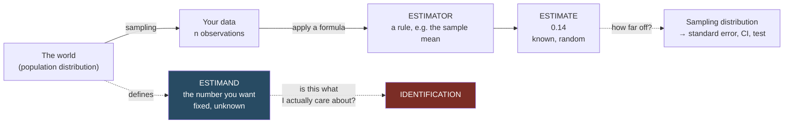

# What Econometrics Is

## The problem it solves

You have data. You want to say something about the world that is not just a description of your data. Three different kinds of question hide behind that sentence, and confusing them is the most common source of bad empirical work.

**1. Description.** *What does the data look like?* Average wage in this sample, share of trades that are aggressive, distribution of firm sizes. No inference needed — just report it.

**2. Prediction.** *Given what I observe about a new unit, what is my best guess of its outcome?* Given a resume, predict the wage. Given the order book state, predict the next price move. Prediction does not require understanding why. A model that predicts umbrella sales from rainfall works fine; a model that predicts rainfall from umbrella sales predicts equally well and is useless for policy.

**3. Causality.** *If I intervene and change X, how does Y change?* If this worker gets one more year of schooling, what happens to their wage? If the exchange changes the fee schedule, what happens to spreads? This is the hardest question and the one most applied work is actually asking, often without admitting it.

Econometrics gives you separate machinery for each and, importantly, tells you when the machinery for prediction is being misused to answer a causal question.



Two arrows do all the damage. The dashed arrow on the right is **inference** — how noisy is my number. The dashed arrow at the bottom is **identification** — is my number even the right target. Software computes the first and is silent about the second.

## Population and sample

The central abstraction: there is a **population** — a probability distribution that describes how units in the world are generated. You observe a **sample** — `n` draws from it. The features of the population are fixed but unknown; the features of the sample are known but random.

| | Population | Sample |
| --- | --- | --- |
| Mean | `μ = E[Y]` (unknown, fixed) | `Ȳ = (1/n)ΣYᵢ` (known, random) |
| Regression slope | `β` | `β̂` |
| Treatment effect | `ATE` | `ATÊ` |

The population quantity you are trying to learn is called the **estimand**. The formula you apply to the sample is the **estimator**. The number that comes out for your particular data is the **estimate**.

Beginners routinely say "the coefficient is 0.14". Which one? The estimate is 0.14. The estimand is some unknown number, and 0.14 is a noisy guess at it. That distinction *is* statistics.

## Sampling assumptions

How the sample relates to the population matters enormously for what you can claim.

- **Random (i.i.d.) sampling** — each observation is an independent draw from the same distribution. The workhorse assumption. Survey data on individuals often approximates this.
- **Clustered sampling** — observations come in groups (students in schools, workers in firms, trades in a day) that are independent *across* groups but dependent *within* them. Common and, if ignored, catastrophic for standard errors. See [[06 - Standard Errors and Clustering]].
- **Time series / dependent sampling** — observations are ordered and correlated with their own past. See [[15 - Time Series]].
- **Panel / longitudinal** — many units observed repeatedly over time. See [[13 - Panel Data]].

The estimator is often the same across these; the *inference* (standard errors, tests) is not.

## Structural vs reduced form

Two traditions, and it helps to know which one a paper is in:

- **Structural**: write down an economic model with behavioral parameters (a utility function, a firm's cost function, a demand elasticity), then estimate those parameters. Strong assumptions, but the parameters mean something and you can simulate counterfactual policies.
- **Reduced form / design-based**: find a situation where variation in the thing you care about is credibly as-good-as-random (a lottery, a policy that hit one state and not another, a discontinuity in a rule), and use it. Weaker assumptions, narrower conclusions — you learn one effect, for one group, in one context.

Modern applied microeconomics leans design-based. These notes cover both, but the identification framing in [[10 - Causality and Identification]] is the design-based one.

## Observational data and the fundamental difficulty

The reason econometrics is hard is that in most data, the people or firms with high `X` differ from those with low `X` in ways you cannot see.

Hansen's running example: does college raise wages? Compare average wages of college graduates and high-school graduates in a survey and you might find a $8.25/hour gap. But people who go to college are not a random subset — they may have higher ability, better connections, more supportive families. Some of that $8.25 is the effect of college and some of it is the fact that college-goers would have earned more anyway.

In his worked example (constructed so the truth is known), the true average causal effect of college is $7.00 and the raw comparison gives $8.25. The raw regression coefficient overstates the causal effect by 18%. Nothing is wrong with the regression — it is correctly estimating the population comparison of means. It just is not estimating the causal effect.

The whole causal half of econometrics is about closing that gap: by controlling for the right variables ([[04 - Conditional Expectation and Projection]]), by finding an instrument ([[11 - Instrumental Variables]]), by exploiting repeated observation of the same unit ([[13 - Panel Data]]), by exploiting a policy change ([[14 - Difference in Differences]]), or by exploiting a sharp cutoff in a rule ([[16 - Nonparametrics, Quantiles, and RDD]]).

## What "the model" actually means

You will constantly see equations like

```
Y = X'β + e
```

This is not a claim that the world is linear. Read carefully, it is a *definition*: `β` is defined as the best linear approximation to the relationship, and `e` is defined as whatever is left over. Under that reading the equation is true by construction and carries no assumptions at all.

Assumptions enter when you say something more:

- "`E[e | X] = 0`" — the linear model is the actual conditional mean (a real restriction).
- "`e` is independent of `X`" — stronger still.
- "`X` is as good as randomly assigned given controls" — a causal claim.

Being precise about which of these you are assuming is 80% of doing econometrics well. [[04 - Conditional Expectation and Projection]] takes this apart carefully.

## Software note

Everything in these notes is implementable in R, Python (statsmodels / linearmodels), Stata, or Julia. Two practical warnings that apply to every package:

1. **Default standard errors are usually the wrong ones.** Most packages default to homoskedastic standard errors, which are rarely appropriate. You must explicitly ask for robust or clustered errors. See [[06 - Standard Errors and Clustering]].
2. **Check your code.** Hansen devotes a whole section to a famous case (Donohue and Levitt on abortion and crime) where a coding error — an omitted set of interaction terms — moved the headline estimate by a factor of nearly three and was only found years later by replicators. Errors in computation are pervasive; the only defense is being proactive. See [[19 - Applied Workflow and Common Mistakes]].

Related:

- [[00 - Econometrics Hub]]
- [[02 - Probability Foundations]]
- [[10 - Causality and Identification]]
- [[19 - Applied Workflow and Common Mistakes]]
