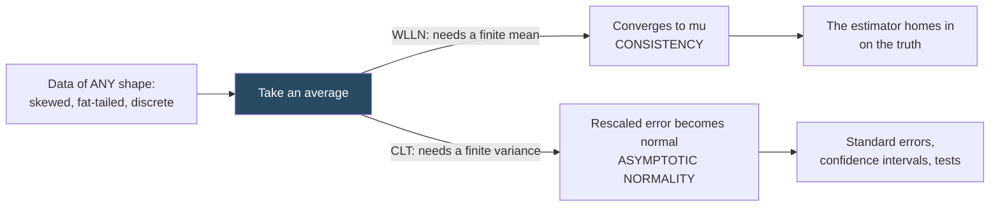

# Probability Foundations

Source: Bruce Hansen, *Probability and Statistics for Economists*, chapters 1-9.

This note covers the probability you need before regression makes sense. If you have seen a first statistics course, skim to the sections on conditional expectation, the law of large numbers, and the central limit theorem — those three are the load-bearing ones.

## Random variables

A **random variable** is a number whose value depends on a random outcome. Formally there is a sample space of outcomes and the random variable is a function from outcomes to numbers, but for practical work the useful mental image is: *a quantity that would come out differently if you re-ran the world*.

- **Discrete**: takes countably many values. Described by a **probability mass function** `π(x) = P[X = x]`.
- **Continuous**: takes values in a continuum. Described by a **density** `f(x)`, where `P[a ≤ X ≤ b] = ∫ₐᵇ f(x)dx`. Note that `f(x)` is *not* a probability — densities can exceed 1.

Both are described by the **distribution function** `F(x) = P[X ≤ x]`, which always exists and is always the safest object to reason about.

**Quantiles** invert the distribution function: the `q`-th quantile is the value `x` with `F(x) = q`. The median is the 0.5 quantile. Quantiles matter in econometrics because many economic questions are about distributions, not averages — "did the policy help the bottom decile?" is a quantile question, not a mean question. See [[16 - Nonparametrics, Quantiles, and RDD]].

## Expectation

The **expectation** (mean, expected value) is the probability-weighted average:

```
E[X] = Σ x·π(x)        (discrete)
E[X] = ∫ x·f(x)dx      (continuous)
```

Key properties, all of which get used constantly:

- **Linearity**: `E[aX + bY + c] = aE[X] + bE[Y] + c`. Always true, no independence needed. This is why linear estimators are so tractable.
- **Not** generally true: `E[g(X)] = g(E[X])`. For convex `g`, **Jensen's inequality** gives `E[g(X)] ≥ g(E[X])`. This is why `E[log(wage)]` and `log(E[wage])` differ, and why log-regression coefficients are not percentage effects on the mean.
- Expectations may not exist. The Cauchy distribution has no mean. This is not a curiosity — the IV estimator under complete identification failure is Cauchy-distributed. See [[11 - Instrumental Variables]].

**Variance** measures spread: `var[X] = E[(X - E[X])²] = E[X²] - (E[X])²`. Its square root is the standard deviation, which has the same units as `X` and is therefore the interpretable one.

`var[aX + b] = a²var[X]` — shifting doesn't change spread, scaling squares it.

## Moments and shape

- 1st moment: mean (location)
- 2nd central moment: variance (spread)
- 3rd standardized: **skewness** (asymmetry)
- 4th standardized: **kurtosis** `κ` (tail thickness). For the normal, `κ = 3`.

Kurtosis is not academic. Hansen notes that the `wage` variable in the CPS data has `κ ≈ 30`. Fat tails mean a handful of observations dominate your sums, which is exactly why homoskedastic standard errors can be badly wrong in wage regressions — in an extreme case the true variance of an OLS estimator is 30 times the value the classical formula expects. See [[06 - Standard Errors and Clustering]].

## Joint, marginal, conditional

With two variables `(X, Y)`:

- **Joint** distribution describes them together.
- **Marginal** is the distribution of one, ignoring the other.
- **Conditional** is the distribution of `Y` restricted to units with a given `X`: `f(y | x) = f(x, y) / f(x)`.

**Independence**: `f(x, y) = f(x)f(y)`. Equivalently, knowing `X` tells you nothing about `Y`.

**Covariance** `cov(X, Y) = E[(X - E[X])(Y - E[Y])]` measures linear co-movement. **Correlation** rescales it to `[-1, 1]`.

The trap: independence implies zero covariance, but zero covariance does **not** imply independence. `Y = X²` with `X` symmetric around zero has zero covariance and total dependence. Econometrics distinguishes these carefully because some estimators need only uncorrelatedness (weak) while causal claims usually need independence (strong).

## Conditional expectation — the key concept

The **conditional expectation function** (CEF) is

```
m(x) = E[Y | X = x]
```

the mean of `Y` among units with `X = x`. It is a *function* of `x`. If `X` is "years of education", `m(x)` is average wage at each education level.

Three properties do most of the work in econometrics:

**Law of iterated expectations (LIE)**: `E[E[Y | X]] = E[Y]`. Averaging the conditional averages gives the unconditional average. More generally `E[E[Y | X, Z] | X] = E[Y | X]` — you can always integrate out the finer conditioning.

**Conditioning theorem**: `E[g(X)Y | X] = g(X)E[Y | X]`. Once you condition on `X`, functions of `X` are constants and factor out.

**CEF decomposition**: define `e = Y - m(X)`. Then always
```
Y = m(X) + e,     with E[e | X] = 0
```
This is a decomposition, not an assumption. Every random variable splits into "the part explained by X" plus "an error that is mean-independent of X". The error automatically satisfies `E[e] = 0`, `E[h(X)e] = 0` for any function `h`, and `cov(X, e) = 0`.

**Why the CEF matters**: it is the best predictor of `Y` given `X` under squared loss. Among all functions `g`, the one minimizing `E[(Y - g(X))²]` is `g = m`. So "the CEF" and "the best mean-squared-error prediction" are the same object. See [[04 - Conditional Expectation and Projection]].

**Variance decomposition**: `var[Y] = var[m(X)] + E[var[Y | X]]`. Total variation splits into variation explained by `X` plus average leftover variation. This is the population version of the R² identity.

## Distributions you will meet

| Distribution | Where it shows up |
| --- | --- |
| **Bernoulli / binomial** | Binary outcomes, treatment indicators, rejection counts in simulations |
| **Normal (Gaussian)** | The limiting distribution of nearly every estimator, via the CLT |
| **Chi-square `χ²_q`** | Wald test statistics with `q` restrictions |
| **Student t** | Small-sample t-statistics under normal errors |
| **F** | Ratio of chi-squares; the F version of a Wald test; first-stage strength |
| **Exponential / gamma** | Durations, waiting times |
| **Lognormal** | Wages, firm sizes, prices — anything positive and right-skewed |
| **Cauchy** | Pathological cases: ratios of normals, unidentified IV |

You do not need to memorize densities. You need to know which one a test statistic converges to and why.

## The two limit theorems

Everything about inference rests on these.



Normality comes from **averaging**, not from the data being normal.

**Weak law of large numbers (WLLN)**: if `X₁,...,Xₙ` are i.i.d. with `E|X| < ∞`, then the sample mean converges in probability to the population mean:
```
X̄ₙ →p E[X]
```
Plain English: sample averages get close to population averages as the sample grows. This is what makes estimation possible at all — it says an estimator built from sample averages is **consistent**.

**Central limit theorem (CLT)**: if additionally `var[X] = σ² < ∞`, then
```
√n(X̄ₙ - μ) →d N(0, σ²)
```
Plain English: the *error* of the sample mean, blown up by `√n`, becomes normally distributed regardless of the shape of the original distribution. This is what makes standard errors and confidence intervals possible.

Two things to internalize:

1. The `√n` rate. To halve your standard error you need four times the data. Precision is expensive.
2. The normality comes from *averaging*, not from the data being normal. Wage data is wildly non-normal; the sample mean of wages is still asymptotically normal. This is why "my data isn't normal" is usually not a valid objection to a regression.

The CLT requires finite variance. With very fat tails (infinite variance) convergence can be to a stable non-normal law and standard inference breaks. Financial return data sits uncomfortably close to this boundary.

## Convergence concepts

| Notation | Name | Means |
| --- | --- | --- |
| `Zₙ →p Z` | in probability | `Zₙ` gets arbitrarily close to `Z` with probability → 1 |
| `Zₙ →d Z` | in distribution | the *distribution* of `Zₙ` approaches that of `Z` |
| `Op(1)` | bounded in probability | doesn't blow up |
| `op(1)` | converges to 0 in probability | negligible |

Two tools you will use without thinking:

- **Continuous mapping theorem**: if `Zₙ →d Z` and `g` is continuous, then `g(Zₙ) →d g(Z)`. Lets you push limits through functions.
- **Slutsky's theorem**: if `Zₙ →d Z` and `Cₙ →p c`, then `Zₙ + Cₙ →d Z + c` and `CₙZₙ →d cZ`. Lets you replace estimated nuisance quantities (like a variance estimate) with their limits.

## Inequalities worth knowing

- **Markov**: `P[X > a] ≤ E[X]/a` for non-negative `X`. Crude but general.
- **Chebyshev**: `P[|X - μ| > a] ≤ var[X]/a²`. The basis of the simplest LLN proof.
- **Jensen**: `E[g(X)] ≥ g(E[X])` for convex `g`.
- **Cauchy-Schwarz**: `|E[XY]| ≤ √(E[X²]E[Y²])`. Why correlations are bounded by 1.
- **Hölder, Minkowski, Lyapunov** — technical generalizations used in proofs.

Related:

- [[01 - What Econometrics Is]]
- [[03 - Statistical Inference Foundations]]
- [[04 - Conditional Expectation and Projection]]
- [[07 - Asymptotic Theory]]
