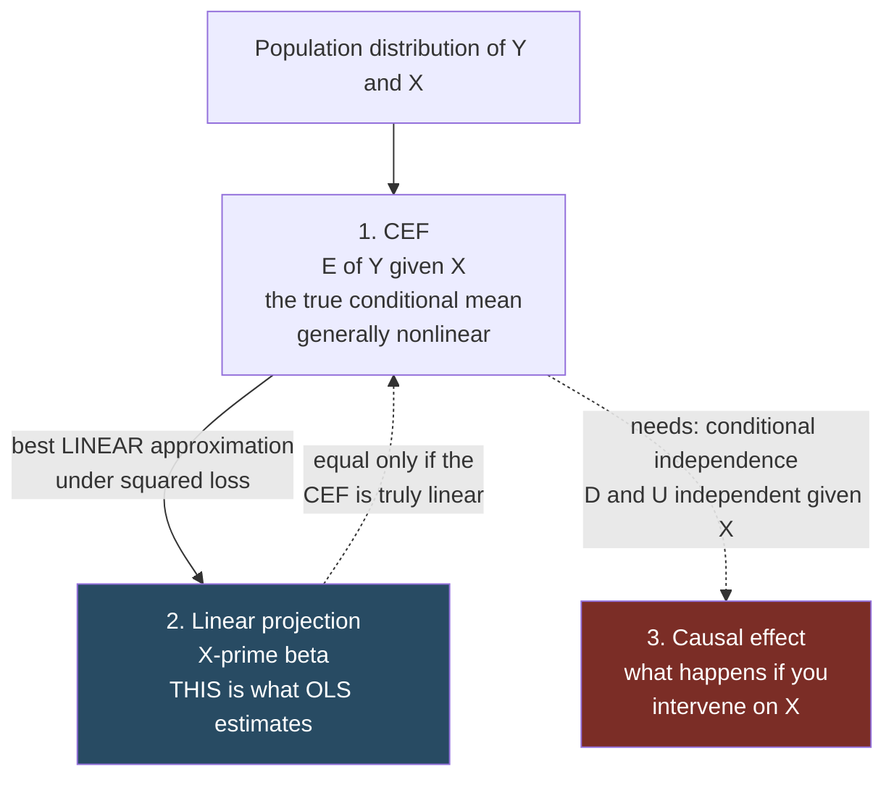
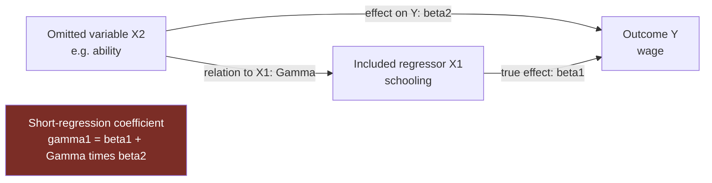

# Conditional Expectation and Projection

Source: Hansen, *Econometrics*, chapter 2. This is the most important conceptual chapter in the book and the one beginners most often skip. It answers the question: **what is a regression actually estimating?**

## Three different objects called "regression"



Each arrow is an assumption you have to argue for. OLS lands you at box 2 for free. Getting to box 1 needs linearity of the CEF. Getting to box 3 needs the CIA, which no test can verify.


Confusion here causes most misinterpretation of regression output. There are three distinct population objects:

1. **The conditional expectation function (CEF)** `m(x) = E[Y | X = x]`. The true average of `Y` at each value of `X`. Generally nonlinear. Always exists (as long as `E|Y| < ∞`).
2. **The best linear predictor / linear projection** `P[Y | X] = X'β`. The best *linear* approximation to the CEF under squared loss. Always exists (given finite second moments and no perfect collinearity), even when the CEF is very nonlinear.
3. **The causal effect** — what would happen to `Y` if you intervened on `X`.

OLS estimates #2. Under extra assumptions #2 equals #1. Under further, much stronger assumptions #1 has a causal reading and equals #3. Each step up needs an argument.

## The CEF and its error

Define `e = Y - m(X)`. Then by construction:

```
Y = m(X) + e          with E[e | X] = 0
```

This is an identity, not an assumption. Consequences that follow automatically:

- `E[e] = 0`
- `E[h(X)e] = 0` for **any** function `h` — the error is uncorrelated with every transformation of `X`, not just `X` itself
- `cov(X, e) = 0`

The strong condition `E[e | X] = 0` is called **mean independence** and it is much stronger than mere uncorrelatedness. It is what makes the CEF the best predictor.

**Best predictor property**: among all functions `g(X)`, the CEF minimizes `E[(Y - g(X))²]`. So if your goal is prediction under squared loss, the CEF is your target, full stop.

**Variance decomposition**: `var[Y] = var[m(X)] + E[var[Y|X]]`. Explained plus unexplained.

## Law of iterated expectations, used properly

`E[E[Y | X, Z] | X] = E[Y | X]`.

This is the formal reason "controlling for more variables changes the coefficient". Conditioning on more variables gives a finer-grained CEF; averaging it back down recovers the coarser one. It is also why you cannot mechanically say "adding controls makes the estimate better" — it makes it *different*, and whether different is better depends on your identification argument.

## Linear projection: what OLS actually targets

Suppose you insist on a linear function. Minimize `E[(Y - X'b)²]` over `b`. The first-order condition is `E[X(Y - X'β)] = 0`, giving

```
β = E[XX']⁻¹ E[XY]
```

This is the **linear projection coefficient**. Three things to notice:

1. It exists whenever second moments are finite and `E[XX']` is invertible (no perfect collinearity). No assumption about linearity of the CEF is needed.
2. The projection error `e = Y - X'β` satisfies `E[Xe] = 0` by construction — **but not** `E[e | X] = 0`. Uncorrelated, not mean-independent. This is a real distinction with real consequences.
3. `β` depends on the distribution of `X`. Change the population you sample from and the projection coefficient changes, even with the same CEF. Projection coefficients are not deep structural parameters.

**Best linear approximation property**: `X'β` is the closest linear function to the CEF in mean square. If the CEF is linear, the projection *is* the CEF. If not, the projection is a weighted-average approximation, weighted by the density of `X`.

Practical implication: if the true relationship curves, a linear regression fits a line through it, and the fitted slope depends on where your data are concentrated. Extrapolating it outside the range of your data is baseless.

## Making linearity less restrictive

Linearity is in the *parameters*, not the variables. All of these are linear regressions:

```
Y = β₀ + β₁X + β₂X² + e                    (polynomial)
log(Y) = β₀ + β₁log(X) + e                 (elasticity)
Y = β₀ + β₁X + β₂D + β₃(X·D) + e           (interaction)
Y = β₀ + β₁·1{X > c} + e                   (dummy / spline)
```

A **saturated** model — one with a full set of dummies and all their interactions — is *exactly* the CEF, not an approximation, because it has one parameter per cell. This is why the 2×2 difference-in-differences regression is guaranteed to be correctly specified while a version with many periods and continuous controls is not. See [[14 - Difference in Differences]].

**Interpretation of common functional forms**:

| Form | `β₁` means |
| --- | --- |
| `Y` on `X` | one unit more `X` → `β₁` units more `Y` |
| `log Y` on `X` | one unit more `X` → roughly `100·β₁` percent more `Y` |
| `log Y` on `log X` | one percent more `X` → `β₁` percent more `Y` (elasticity) |
| `Y` on `log X` | one percent more `X` → `β₁/100` units more `Y` |

The log approximations are good for small `β₁`; for large coefficients use `exp(β₁) - 1`.

**Regression derivative**: for a general specification, the effect of `x₁` is `∂m(x)/∂x₁`, which with interactions or polynomials depends on the other variables. Always report the derivative at meaningful values, not the raw coefficient on a term that appears in three places.

## Omitted variable bias

The single most useful formula in applied work. Suppose the correct long regression is

```
Y = X₁'β₁ + X₂'β₂ + e
```

but you estimate the short regression of `Y` on `X₁` only. The short-regression coefficient is

```
γ₁ = β₁ + Γβ₂
```

where `Γ` is the projection coefficient from regressing `X₂` on `X₁`. The bias term `Γβ₂` is:

```
bias = (relation between omitted and included variable) × (effect of omitted variable)
```



**Sign reasoning.** If the omitted variable raises `Y` (`β₂ > 0`) and is positively related to `X₁` (`Γ > 0`), the short regression *overstates* `β₁`. Ability and schooling is the classic case: ability raises wages and is positively correlated with schooling, so a wage-on-schooling regression overstates the return to schooling.

Bias vanishes if either the omitted variable has no effect (`β₂ = 0`) or is unrelated to the included ones (`Γ = 0`) — which is exactly why randomization works: it forces `Γ = 0` for everything.

**The mirror-image mistake**: adding controls is not automatically safe. Controlling for a variable that is itself *caused* by the treatment (a "bad control" or mediator) blocks part of the effect you want. Controlling for a common *consequence* of treatment and outcome (a collider) creates bias where none existed. The rule is not "more controls"; it is "controls that break the dependence between treatment and unobservables, and nothing downstream of treatment".

## Causal reading: when is a regression coefficient a causal effect?

Hansen builds this carefully using the potential outcomes framework.

Write `Y = h(D, X, U)` where `D` is treatment, `X` are observed covariates, `U` are unobserved individual factors. The individual **causal effect** is

```
C(X, U) = h(1, X, U) - h(0, X, U)
```

the change in `Y` from switching treatment while holding everything else fixed. It is individual-specific and never observed — you only ever see one of the two potential outcomes for any unit.

The **average causal effect** `ACE = E[C]`, and the **conditional** version `ACE(x) = E[C | X = x]`.

**Conditional Independence Assumption (CIA)**: conditional on `X`, the variables `D` and `U` are independent.

**Theorem**: under the CIA, the regression derivative equals the conditional average causal effect:
```
m(1, x) - m(0, x) = ACE(x)
```

That is the licence to interpret a regression coefficient causally, and it is entirely conditional on the CIA — an assumption about unobservables that no test can verify.

### Hansen's worked example (worth memorizing)

Two types of people, "Jennifer" and "George". Jennifer earns $10/hr with high school, $20/hr with college — causal effect $10. George earns $8 with high school, $12 with college — causal effect $4. Half the population is each type, so the true `ACE = $7`.

College attendance is decided by an aptitude test. High score → 3/4 probability of college; low score → 1/4. Jennifers get high scores 3/4 of the time, Georges 1/4 of the time.

An econometrician who observes only wages and education finds:

| | Mean wage |
| --- | --- |
| High-school graduates | $8.75 |
| College graduates | $17.00 |
| **Difference (the regression coefficient)** | **$8.25** |

$8.25 ≠ $7.00. The regression overstates the causal effect by $1.25 because Jennifers have both a bigger causal effect *and* a higher probability of attending college.

Now add the test score to the regression:
```
E[wage | college, highscore] = 8.50 + 1.00·highscore + 5.50·college + 3.00·(highscore × college)
```
The effect of college is $5.50 for low scorers and $8.50 for high scorers. Both are the true conditional causal effects, and their average (50/50) is exactly $7.00 — the true ACE.

**The lesson**: the same data give a wrong answer and a right answer depending on whether you condition on the variable that drives selection. Conditioning on a *sufficiently rich* set of covariates is what makes regression causal. The word "sufficiently" is doing all the work and is untestable.

## Practical takeaways

- Never describe a coefficient as "the effect of X" unless you can state the identification argument. "The conditional association between X and Y, holding Z constant" is the honest default.
- Before adding a control, ask: is it a confounder (add it), a mediator (usually don't), or a collider (definitely don't)?
- When your model is not saturated, remember your estimate is an approximation whose value depends on the distribution of your regressors.
- Use the OVB formula to sign the likely direction of remaining bias, and say so in the writeup. Reviewers respect "our estimate is likely an upper bound because..." far more than silence.

Related:

- [[02 - Probability Foundations]]
- [[05 - Least Squares Mechanics]]
- [[10 - Causality and Identification]]
- [[11 - Instrumental Variables]]
