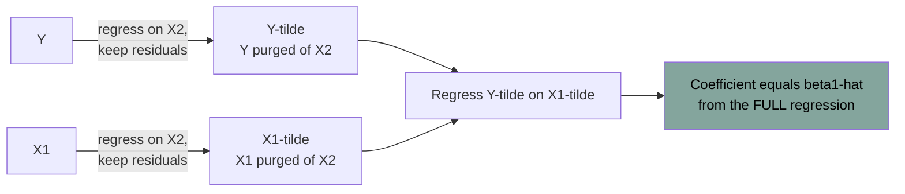

# Least Squares Mechanics

Source: Hansen, *Econometrics*, chapters 3-4.

This note is pure algebra and geometry — no probability. Everything here is true of any dataset regardless of how it was generated. Separating the algebra from the statistics is the cleanest way to learn OLS.

## The estimator

Given data `(Yᵢ, Xᵢ)` for `i = 1,...,n`, ordinary least squares chooses `β̂` to minimize the sum of squared residuals:

```
SSE(b) = Σᵢ (Yᵢ - Xᵢ'b)²
```

Setting the derivative to zero gives the **normal equations** `Σ Xᵢ(Yᵢ - Xᵢ'β̂) = 0` and the solution

```
β̂ = (X'X)⁻¹ X'Y  =  (Σ XᵢXᵢ')⁻¹ (Σ XᵢYᵢ)
```

This is exactly the sample analog of the population projection `β = E[XX']⁻¹E[XY]` from [[04 - Conditional Expectation and Projection]]. OLS is the plug-in estimator of the linear projection.

**Fitted values** `Ŷᵢ = Xᵢ'β̂`. **Residuals** `êᵢ = Yᵢ - Ŷᵢ`.

Do not confuse the **residual** `ê` (computed, observed) with the **error** `e` (unobservable, population). Almost every subtlety in regression theory comes from the fact that residuals are not errors.

## Algebraic properties that always hold

If the regression includes an intercept:

- `Σ êᵢ = 0` — residuals sum to zero
- `Σ Xᵢ êᵢ = 0` — residuals are orthogonal to every regressor, by construction
- `Ȳ = X̄'β̂` — the fitted line passes through the means

These are consequences of the first-order conditions, not evidence that your model is correct. A common beginner error is treating "the residuals are uncorrelated with X" as a diagnostic result. It is arithmetic.

## Geometry

Think of `Y` as a vector in `n`-dimensional space and the columns of `X` as spanning a `k`-dimensional subspace. OLS drops a perpendicular from `Y` onto that subspace.

- **Projection matrix** `P = X(X'X)⁻¹X'`, so `Ŷ = PY`.
- **Annihilator matrix** `M = I - P`, so `ê = MY`.
- Both are symmetric and idempotent (`PP = P`), and `PM = 0`.
- `Y = Ŷ + ê` decomposes `Y` into two orthogonal pieces. Pythagoras gives `Y'Y = Ŷ'Ŷ + ê'ê`.

Everything about "explained" and "unexplained" variation is this right triangle.

## Goodness of fit

```
R² = 1 - SSE/TSS = explained variation / total variation
```

Properties and warnings:

- `R²` never decreases when you add a regressor, even a random one. It cannot be used for model selection.
- **Adjusted R²** penalizes parameters, but the penalty is ad hoc; use proper criteria (AIC, cross-validation) instead. See [[18 - Model Selection and Machine Learning]].
- A high `R²` says nothing about causality or correct specification. A low `R²` is normal and fine in cross-sectional microdata — individual outcomes are mostly idiosyncratic.
- For *prediction*, what matters is out-of-sample error, not in-sample `R²`.

Hansen prefers reporting `σ̂²` or the standard error of the regression over `R²`, on the grounds that it is in interpretable units.

## Frisch-Waugh-Lovell (FWL)

Split regressors into two groups: `Y = X₁'β₁ + X₂'β₂ + e`. Then `β̂₁` can be obtained by:

1. Regress `Y` on `X₂`, keep residuals `Ỹ`.
2. Regress `X₁` on `X₂`, keep residuals `X̃₁`.
3. Regress `Ỹ` on `X̃₁`. The coefficient equals `β̂₁` from the full regression.



**Why this matters**:

- It is the precise meaning of "controlling for `X₂`": `β̂₁` uses only the variation in `X₁` that is *unrelated* to `X₂`.
- It explains why adding highly correlated controls inflates standard errors — you are throwing away variation in `X₁`.
- It is the computational trick behind fixed-effects estimation: demeaning within groups is exactly "partialling out group dummies". See [[13 - Panel Data]].
- It underlies the partialling-out lasso and double machine learning estimators. See [[18 - Model Selection and Machine Learning]].

A corollary: including a constant is equivalent to demeaning all variables first.

## Leverage and influence

The `i`-th diagonal of the projection matrix, `hᵢᵢ`, is the **leverage** of observation `i`. It measures how much observation `i` pulls its own fitted value. Facts:

- `0 ≤ hᵢᵢ ≤ 1` and `Σ hᵢᵢ = k`, so average leverage is `k/n`.
- High leverage means an unusual `X` value — far from the centroid of the regressors.
- The **prediction (leave-one-out) residual** is `ẽᵢ = êᵢ/(1 - hᵢᵢ)`. This is the residual you'd get if the observation had been excluded from fitting, and it is available in closed form (no need to actually refit `n` times).
- The **influence** of observation `i` on the fitted coefficients is proportional to `hᵢᵢêᵢ/(1 - hᵢᵢ)`.

Practical rule: look at the largest few `hᵢᵢ`. If one observation has leverage near 1, your regression is partly an interpolation of that one point. This also matters for standard errors — the HC2 and HC3 variance estimators are leverage-weighted, and they diverge from HC1 exactly when leverage is unequal. See [[06 - Standard Errors and Clustering]].

The extreme case: a dummy variable that equals 1 for a single observation has leverage 1 for that observation. The coefficient is then determined by that one point, the residual is exactly zero, and robust standard errors are severely biased toward zero. This is the same pathology that afflicts difference-in-differences with a single treated unit. See [[14 - Difference in Differences]].

## Estimating the error variance

Three estimators of `σ²`:

```
σ̂² = (1/n) Σ êᵢ²              biased down
s²  = (1/(n-k)) Σ êᵢ²         unbiased under homoskedasticity
σ̄²  = (1/n) Σ ẽᵢ²             uses prediction residuals; estimates MSFE
```

The `n-k` adjustment appears because residuals are "too small": fitting `k` parameters uses up variation. Formally `E[êᵢ²] = (1 - hᵢᵢ)σᵢ²`.

`σ̄²`, built from leave-one-out prediction errors, is an estimate of **out-of-sample** mean squared forecast error. It is the in-sample computable version of leave-one-out cross-validation, and it is the right thing to look at if your goal is prediction.

## Collinearity

**Perfect collinearity** — one regressor is an exact linear combination of others. `X'X` is singular and OLS has no unique solution. Software will drop a variable or error. Causes: including all dummy categories plus an intercept (the "dummy variable trap"), including a variable and its duplicate, or including a time-invariant regressor in a fixed-effects model.

**Near collinearity** — regressors are highly correlated. `β̂` is still unbiased and consistent, but its variance is inflated. With two regressors of correlation `ρ`, the variance of each slope is proportional to `1/(1 - ρ²)`.

Hansen relays Arthur Goldberger's point: near-collinearity is not a disease with a cure. It means *the data contain little independent information about these coefficients*, which is statistically identical to having a small sample. Variance-inflation-factor rituals and dropping variables to "fix" collinearity do not create information; dropping a needed control just swaps a variance problem for a bias problem.

What to actually do: report the wide confidence interval honestly, or test a joint hypothesis about the collinear group rather than individual coefficients, or reparameterize (e.g. use the sum and difference of two collinear variables when one of those is what you care about).

## Restricted least squares

Sometimes theory imposes a restriction, e.g. constant returns to scale means coefficients sum to 1. Minimizing SSE subject to `R'β = c` gives a closed-form **restricted least squares** estimator. It has lower variance than unrestricted OLS if the restriction is true, and is biased if false — another bias-variance trade. The test of whether the restriction holds is a Wald test, covered in [[08 - Hypothesis Testing and Confidence Intervals]].

## Statistical properties (the bridge to the next note)

Under the linear regression model `E[e | X] = 0`:

- **Unbiasedness**: `E[β̂ | X] = β`.
- **Conditional variance**: `V = (X'X)⁻¹(X'DX)(X'X)⁻¹` where `D = diag(σ₁²,...,σₙ²)`. Under homoskedasticity (`σᵢ² = σ²` for all `i`) this collapses to `(X'X)⁻¹σ²`.
- **Gauss-Markov theorem**: under homoskedasticity, OLS has the smallest variance among all linear unbiased estimators (BLUE). Note the three qualifiers — linear, unbiased, homoskedastic. Drop any one and OLS is not optimal.

Homoskedasticity is the assumption that the error variance is the same for every observation. It is almost never true in real data, which is why the next note is about what to do instead.

Related:

- [[04 - Conditional Expectation and Projection]]
- [[06 - Standard Errors and Clustering]]
- [[07 - Asymptotic Theory]]
- [[13 - Panel Data]]
