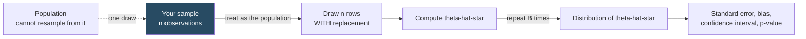

# Bootstrap and Resampling

Source: Hansen, *Econometrics*, chapter 10.

## The idea

You want to know the sampling distribution of `θ̂` — how it would vary across repeated samples from the population. You cannot draw more samples from the population. But you *can* draw samples from your sample.

The **bootstrap** treats the empirical distribution of your data (the "empirical distribution function", which puts mass `1/n` on each observation) as a stand-in for the population, and simulates the sampling process from it.

**The algorithm** (nonparametric / pairs bootstrap):

1. Draw `n` observations **with replacement** from your dataset. Some rows appear twice, some not at all. Call this a bootstrap sample.
2. Compute the estimator on it: `θ̂*`.
3. Repeat `B` times, storing `θ̂*(1), ..., θ̂*(B)`.
4. Use the spread and shape of the `θ̂*` values to approximate the sampling distribution of `θ̂`.

Standard choice: `B = 1,000` for standard errors, `B = 10,000` for confidence intervals and tests (quantiles in the tails need more draws).



**Key mental move**: in the bootstrap universe, `θ̂` (your original estimate) *is* the true parameter. That is why bootstrap statistics are centered at `θ̂`, not at zero or at a hypothesized value. Getting this centering wrong is the most common bootstrap bug.

## What the bootstrap gives you

**Bootstrap standard error**: the sample standard deviation of the `θ̂*` draws.

**Bias estimate**: `mean(θ̂*) - θ̂`. Can be used for bias correction, though this adds variance and is not always worth it.

**Confidence intervals** — several constructions, in increasing order of quality:

| Interval | Construction | Accuracy |
| --- | --- | --- |
| Normal-approximation | `θ̂ ± 1.96·se_boot` | first-order |
| Percentile | the 2.5% and 97.5% quantiles of `θ̂*` | first-order, transformation-respecting |
| BC (bias-corrected) percentile | percentile with a median-bias correction `z₀` | first-order |
| BCa (accelerated) | BC plus a skewness correction `a` from the jackknife | second-order |
| **Percentile-t** | based on bootstrapping the t-ratio | **second-order** |

## The percentile-t interval (the one to use)

Instead of bootstrapping `θ̂`, bootstrap the **studentized** statistic:

```
T* = (θ̂* - θ̂) / s(θ̂*)
```

Note carefully: numerator centered at `θ̂` (the bootstrap-universe truth), denominator is the standard error computed *within each bootstrap sample*. The interval is

```
C = [ θ̂ - s(θ̂)·q*_{1-α/2} ,  θ̂ - s(θ̂)·q*_{α/2} ]
```

where `q*` are quantiles of the `T*` draws. The endpoints look "backwards" — the upper quantile determines the lower endpoint — and that is correct; it is what makes coverage right for asymmetric distributions.

**Why it is better.** Ordinary asymptotic intervals have coverage `1 - α + O(n^{-1/2})`. The percentile-t interval has coverage `1 - α + O(n^{-1})`. That improvement is called an **asymptotic refinement**, and it comes from the fact that the t-ratio is asymptotically pivotal (its limiting distribution does not depend on unknown parameters). The proof runs through Edgeworth and Cornish-Fisher expansions.

The BCa interval is asymptotically equivalent to percentile-t and also achieves refinement. The plain percentile, normal-approximation, and BC intervals do **not**.

**Disadvantages of percentile-t**: you need a standard error formula (so it is infeasible if you have none), and it costs a standard error computation per bootstrap replication. If no analytic standard error exists you can use a nested bootstrap, at `B²` cost.

**Diagnostic tip**: if the bootstrap t-quantiles are near `±2`, your asymptotic approximation is fine. If they are wildly different — say `-1.2` and `+4.5` — that is real evidence of skewness or non-normality. (It is also a common symptom of a programming error, so triple-check.)

## Bootstrap hypothesis tests

To test `H₀: θ = θ₀`:

1. Compute the sample t-statistic `T = (θ̂ - θ₀)/s(θ̂)`.
2. On each bootstrap sample compute `T*(b) = (θ̂*(b) - θ̂)/s(θ̂*(b))` — **centered at `θ̂`, not `θ₀`**.
3. Bootstrap p-value: `p* = (1/B)·#{ |T*(b)| > |T| }`.

The centering point is where people go wrong. If the hypothesis is `θ = 0` it is tempting to use `T* = θ̂*/s(θ̂*)`. That is wrong. The bootstrap distribution must be the distribution *under the null in the bootstrap universe*, and in that universe the true value is `θ̂`.

The same refinement applies: the bootstrap test has size `α + o(n⁻¹)` versus `α + O(n⁻¹)` for the asymptotic test.

For overidentification tests (the Sargan/J statistic in 2SLS), the bootstrap statistic must be **recentered** so it satisfies the moment conditions in the bootstrap universe. Hansen gives the explicit formula.

## Bootstrap variants

**Pairs bootstrap** — resample `(Yᵢ, Xᵢ)` jointly. Robust to heteroskedasticity and misspecification. The default choice for cross-sectional regression.

**Residual bootstrap** — hold `X` fixed, resample residuals, rebuild `Y* = X'β̂ + e*`. Imposes homoskedasticity. Use only if you believe it.

**Wild bootstrap** — hold `X` and residuals in place, multiply each residual by a random scalar with mean 0 and variance 1 (e.g. Rademacher: `+1` or `-1` with probability 1/2). Preserves heteroskedasticity. Good in small samples.

**Wild cluster bootstrap** — the wild bootstrap with one shared multiplier per cluster. **This is the standard remedy for few clusters** (`G` under roughly 30-40), where cluster-robust asymptotics are unreliable. See [[06 - Standard Errors and Clustering]].

**Block bootstrap** — for time series, resample contiguous blocks of observations to preserve serial dependence. Block length must grow with `n`; choosing it is an art. Variants: moving blocks, stationary bootstrap, sieve bootstrap. See [[15 - Time Series]].

**Parametric bootstrap** — simulate from a fitted parametric model rather than resampling data.

## The jackknife

Older and simpler: recompute the estimator `n` times, each time leaving out one observation. `θ̂₍ᵢ₎` is the leave-one-out estimate.

- Jackknife variance estimate: `((n-1)/n)·Σ(θ̂₍ᵢ₎ - θ̄)²`.
- Jackknife bias estimate: `(n-1)(θ̄ - θ̂)`.
- For linear regression, the jackknife has a closed form via leverage — no refitting needed. This is precisely where the HC3 variance estimator comes from.
- The jackknife skewness estimate supplies the acceleration constant `a` in the BCa interval.

The jackknife is less general than the bootstrap (it fails for non-smooth estimators like the median) but is cheap and analytic for regression.

## When the bootstrap fails

Not a universal solvent. Known failure cases:

- **Non-smooth estimators**: the sample median, maximum, or minimum. Sample extremes are especially bad — a bootstrap sample cannot exceed the original maximum.
- **Parameters on a boundary** (e.g. a variance constrained to be non-negative).
- **Weak or failed identification** — bootstrapping 2SLS with weak instruments does not fix weak-instrument inference. Hansen has an explicitly titled discussion of "the peril of bootstrap 2SLS standard errors": in the just-identified case the estimator has no finite moments, so the bootstrap standard error is estimating something that does not exist and can be arbitrarily large or small. Report bootstrap *intervals* (which are quantile-based and fine) rather than bootstrap standard errors.
- **Heavy tails / infinite variance**.
- **Strong dependence** not respected by the resampling scheme — using the i.i.d. bootstrap on clustered or serially correlated data reproduces exactly the mistake you were trying to avoid.
- **Very few clusters** — even the wild cluster bootstrap degrades below roughly 10 clusters.

**Rule**: the bootstrap resampling scheme must mirror the actual sampling scheme. i.i.d. data → i.i.d. resampling. Clustered data → resample whole clusters. Time series → blocks.

## Practical guidance

- Use `B = 10,000` for intervals and tests when computationally feasible; `B = 1,000` is a minimum.
- Set and record a random seed. Bootstrap results are not reproducible without it.
- Prefer percentile-t or BCa intervals over plain percentile.
- Bootstrap is not a fix for endogeneity, misspecification, or weak identification. It refines inference about the estimand you have; it does not change what that estimand is.

Related:

- [[06 - Standard Errors and Clustering]]
- [[07 - Asymptotic Theory]]
- [[08 - Hypothesis Testing and Confidence Intervals]]
- [[11 - Instrumental Variables]]
- [[15 - Time Series]]
