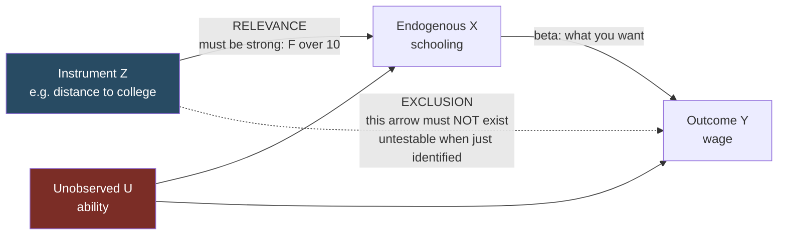

# Instrumental Variables

Source: Hansen, *Econometrics*, chapter 12.

## The problem

You want `β` in `Y = X'β + e`, but `E[Xe] ≠ 0`. The regressor is **endogenous**. Then OLS is inconsistent:

```
β̂_ols →p β + E[XX']⁻¹E[Xe] ≠ β
```

More data does not help. Three standard sources of endogeneity:

- **Omitted variables** — an unobserved confounder is in `e` and correlated with `X`. (Ability in a wage-schooling regression.)
- **Simultaneity / reverse causality** — `Y` also causes `X`. (Price and quantity determined jointly by supply and demand.)
- **Measurement error** in `X` — classical measurement error puts the error in `e` and correlates it with the mismeasured regressor, producing **attenuation bias** toward zero.

## Instruments

An **instrument** `Z` must satisfy:

1. **Relevance**: `Z` is correlated with `X` (conditional on any included exogenous controls). Testable.
2. **Exogeneity / exclusion**: `E[Ze] = 0` — `Z` affects `Y` only through `X`. **Not testable** if the model is just identified.

Then, in the simplest just-identified case:

```
β = cov(Z, Y) / cov(Z, X)
```

The **Wald / IV estimator** is the sample analog. With a binary instrument this is
```
β̂ = ( Ȳ|Z=1 - Ȳ|Z=0 ) / ( X̄|Z=1 - X̄|Z=0 )
```
— the reduced-form effect of `Z` on `Y`, divided by the first-stage effect of `Z` on `X`. This ratio structure is the source of everything good and everything bad about IV.



The whole method is: variation in `X` driven by `Z` is uncontaminated by `U`, so use only that slice of the variation. The cost is that you learn about a narrower population.

## Two-stage least squares (2SLS)

With more instruments than endogenous regressors (`ℓ > k`, **overidentified**):

- **First stage**: regress each endogenous `X` on all instruments and exogenous controls; get fitted values `X̂`.
- **Second stage**: regress `Y` on `X̂` and controls.

In matrix form `β̂_2sls = (X'P_Z X)⁻¹(X'P_Z Y)` with `P_Z = Z(Z'Z)⁻¹Z'`.

**Never run the two stages manually.** The second-stage standard errors from a manual two-step are wrong — they ignore that `X̂` is estimated. Use `ivreg2`/`ivregress` in Stata, `AER::ivreg` or `fixest::feols` in R, `linearmodels.IV2SLS` in Python.

**Include all exogenous regressors as their own instruments.** A control variable in the structural equation must also appear in the first stage.

**Alternative estimators**: LIML (limited information maximum likelihood) and JIVE. LIML is less biased than 2SLS under weak and many instruments — see below — and is worth reporting alongside 2SLS whenever instruments are numerous or weak.

## LATE: what IV actually estimates

With heterogeneous effects, IV does not estimate the ATE. Imbens and Angrist showed it estimates the **local average treatment effect**.

Take binary `Z` and binary `X`. Classify units by how they respond to the instrument:

| | `X(0) = 0` | `X(0) = 1` |
| --- | --- | --- |
| **`X(1) = 0`** | Never Takers | Defiers |
| **`X(1) = 1`** | **Compliers** | Always Takers |

- **Never takers**: never treated, whatever `Z` says. You only ever see `Y(0)` for them — their effect is unknowable.
- **Always takers**: always treated. You only ever see `Y(1)` — also unknowable.
- **Compliers**: treated if and only if `Z = 1`. These are the only units the instrument moves.
- **Defiers**: do the opposite. Assumed away.

**Monotonicity** (no defiers): `X(1) ≥ X(0)`. The instrument never pushes anyone the wrong way.

Under independence of `Z` from `U`, plus monotonicity:

```
LATE = E[Y(1) - Y(0) | X(1) > X(0)]
     = ( E[Y|Z=1] - E[Y|Z=0] ) / ( E[X|Z=1] - E[X|Z=0] )
```

which is exactly the IV estimand.

**Consequences you must internalize**:

- IV tells you about compliers only. If compliers are unusual, the estimate does not generalize.
- **Different instruments give different LATEs.** Hansen: college proximity and college tuition move overlapping but different students; if their causal effects differ, so do the two LATEs. This is not a puzzle — it is what heterogeneity means. The classic constant-coefficient IV model assumes it away.
- The complier population is defined by the instrument, is not observed directly, but its size (`E[X|Z=1] - E[X|Z=0]`, the first stage) and some of its characteristics can be estimated.

## Complete identification failure

If the instrument is truly irrelevant (`cov(Z,X) = 0`, the first-stage coefficient `γ = 0`), everything breaks:

- `β̂_iv` does **not** converge to a constant. It converges in distribution to a **random variable**: `β + ξ₀/ξ₂`, a ratio of independent normals — that is, **Cauchy**.
- The Cauchy has **no mean**. Thick tails, extreme values common.
- The estimator is **median biased** toward the OLS probability limit — IV does not even correct the centering of OLS.
- Worse for practice: the estimated error variance `σ̂² →p 0`, so the conventional standard error collapses and `|T| →p ∞`. **You get spuriously tiny standard errors and huge t-statistics on a completely meaningless estimate.**

That last point is the one to remember. Weak-instrument pathology looks like *precision*, not like noise.

## Weak instruments

Real failures are partial, not complete. The **local-to-zero** device (Staiger-Stock) models the first-stage coefficient as `Γ = n^{-1/2}C`, so that the signal never dominates the noise no matter how large `n` is. Under this asymptotic:

- OLS is inconsistent.
- 2SLS is **inconsistent**, asymptotically random, and non-normal.
- LIML is likewise inconsistent under weak instruments, though bias-corrected relative to 2SLS.

Conventional confidence intervals have coverage far below nominal.

### Testing for weak instruments

**Stock-Yogo**: test the null that the instruments are weak enough to cause unacceptable distortion, using the **first-stage F statistic** for excluded instruments.

The logic in two steps (single endogenous regressor, single instrument):

1. Find the threshold `τ²` such that if the concentration parameter `μ² ≥ τ²`, the true size of a nominal 5% t-test is at most `r`. For `r = 0.15` (15% actual size), `τ² = 1.70`.
2. Test `H₀: μ² = τ²` against `μ² > τ²` at 5% using the first-stage `F`. The critical value is 8.7 (Stock-Yogo report 9.0 using `τ² = 1.82`).

This is where the famous **"first-stage F > 10"** rule of thumb comes from.

Two useful reframings from Hansen:

- `F > 8.7` is equivalent to a first-stage **t-statistic above 2.94** (or 3.16 for `F > 10`) — considerably more demanding than "the first stage is significant".
- Equivalently: verify the t-statistic on the excluded instrument in the reduced form exceeds **3 in absolute value**.

With more instruments the critical values change substantially. From the Stock-Yogo table (single endogenous regressor, maximal size 15%):

| # instruments `ℓ₂` | 2SLS critical value | LIML critical value |
| --- | --- | --- |
| 1 | 9.0 | 9.0 |
| 2 | 11.6 | 5.3 |
| 3 | 12.8 | 4.4 |
| 5 | 15.1 | 3.6 |
| 10 | 20.9 | 2.8 |
| 20 | 32.8 | 2.3 |
| 30 | 44.8 | 2.2 |

Note how the required `F` for 2SLS grows with the number of instruments while LIML's *falls*. LIML is markedly more robust when instruments are many.

The two-step Stock-Yogo procedure has size bounded by `r + 0.05` (Bonferroni), so `r = 0.15` gives a rigorous 20% test.

### What to do about weak instruments

1. Report the first-stage F and the number of instruments. Always.
2. Prefer **LIML** to 2SLS when instruments are many or borderline.
3. Use **weak-instrument-robust inference**: Anderson-Rubin confidence sets, conditional likelihood ratio (CLR) tests. These have correct coverage regardless of instrument strength. They can produce unbounded or empty confidence sets — that is honest reporting of "the data are uninformative", not a bug.
4. Do **not** rely on the bootstrap. Hansen's section on "the peril of bootstrap 2SLS standard errors": in the just-identified case the IV estimator has no finite moments, so a bootstrap *standard error* estimates a nonexistent quantity. Bootstrap *quantile-based intervals* are fine; bootstrap standard errors are not.
5. Reconsider the design. A weak instrument plus a slight exclusion violation is worse than OLS, because the bias is divided by a near-zero first stage.

## Many instruments

Separate but related problem, formalized by Bekker: let `ℓ/n → α`. Then

```
β̂_ols  →p β + (H + Σ₂₂)⁻¹ Σ₂ₑ
β̂_2sls →p β + (H + αΣ₂₂)⁻¹ αΣ₂ₑ
β̂_liml →p β
```

2SLS is inconsistent, with inconsistency increasing in `α`; at `α = 1` it coincides with OLS. LIML is consistent under many instruments (under conditional homoskedasticity — the result may fail with heteroskedasticity).

**Practical rule**: compute the many-instrument ratio `α = ℓ/n`. If `α ≥ 0.05`, be seriously concerned and prefer LIML.

## Testing overidentifying restrictions

With `ℓ > k` instruments you have surplus moment conditions and can test them: the **Sargan** statistic (2SLS) or **Hansen J** statistic (GMM). Under the null that *all* instruments are valid, `S →d χ²_{ℓ-k}`.

Interpretation cautions:

- Rejection means at least one instrument is invalid or the model is misspecified — it does not tell you which.
- Failure to reject is weak evidence: the test has low power, and if all instruments share the same flaw the test cannot see it.
- The test says nothing at all in the just-identified case, which is where most credible IV designs live.

A bootstrap version exists and requires recentering the statistic so the moment conditions hold in the bootstrap universe.

## Control function approach

An equivalent route for the linear model, and a generalization beyond it: estimate the first stage, save its residual `v̂`, then include `v̂` as an extra regressor in the structural equation. The coefficient on `X` is numerically the 2SLS estimate, and the t-test on `v̂` is a **Hausman test** for endogeneity. Standard errors must account for the first stage (bootstrap or analytic correction). This approach extends to nonlinear models where 2SLS does not.

## Reporting checklist

- The instrument and, in words, why exclusion is plausible — plus the most credible violation story.
- First-stage coefficient, its standard error, and the first-stage F.
- Number of instruments and `ℓ/n`.
- 2SLS and LIML estimates side by side.
- OLS for comparison, with a note on which direction the bias should go.
- Overidentification test if applicable.
- Who the compliers are, and to what population the LATE applies.

Related:

- [[10 - Causality and Identification]]
- [[12 - GMM and Minimum Distance]]
- [[09 - Bootstrap and Resampling]]
- [[18 - Model Selection and Machine Learning]]
