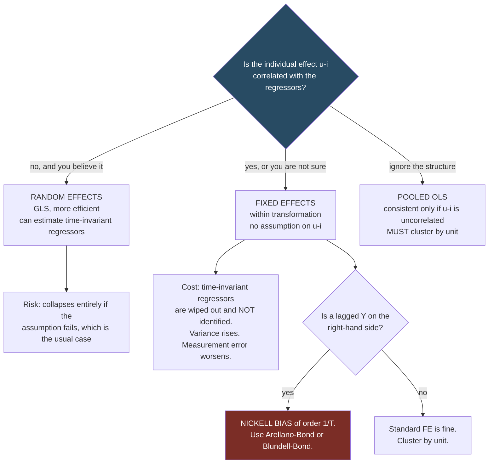

# Panel Data

Source: Hansen, *Econometrics*, chapter 17.

## What panel data buys you

A **panel** (longitudinal dataset) observes the same units `i = 1,...,N` over multiple periods `t`. Notation: `Yᵢₜ`, `Xᵢₜ`. **Balanced** if every unit appears in every period, **unbalanced** otherwise.

The payoff: if the confounder is a *fixed characteristic of the unit*, you can eliminate it by comparing the unit to itself over time. You do not need to observe the confounder, name it, or measure it. That is a genuinely powerful trick, and it is the main reason panels are valuable.

The limitation: it only works for confounders that do not change over time. It does nothing about time-varying unobservables.

## The one-way error component model

```
Yᵢₜ = Xᵢₜ'β + uᵢ + εᵢₜ
```

- `uᵢ` — the **individual effect**, constant over time. Unobserved ability, firm culture, regional geography.
- `εᵢₜ` — the **idiosyncratic error**, varying over both `i` and `t`.

Everything in panel econometrics turns on one question: **is `uᵢ` correlated with `Xᵢₜ`?**



## The three estimators

### 1. Pooled OLS

Ignore the panel structure entirely; regress `Y` on `X`. Consistent only if `E[Xᵢₜ(uᵢ + εᵢₜ)] = 0` — that is, if `uᵢ` is uncorrelated with the regressors. Standard errors **must** be clustered by individual because `uᵢ` induces within-unit correlation across all periods. See [[06 - Standard Errors and Clustering]].

### 2. Random effects (RE)

Assume `uᵢ` is uncorrelated with `Xᵢₜ` and treat it as part of a structured error with covariance `Ω = σ_u² 11' + σ_ε² I`. Apply GLS. This is more efficient than pooled OLS under the assumption (`V_gls ≤ V_pool`), and identical when `σ_u² = 0`.

RE can estimate coefficients on time-invariant regressors, which FE cannot. That is its main practical attraction.

The catch: the whole thing collapses if `uᵢ` is correlated with `Xᵢₜ` — which is exactly the case the researcher usually suspects. Hansen recommends cluster-robust standard errors even for RE, since the assumed covariance structure is rarely literally true.

### 3. Fixed effects (FE)

Make no assumption about `uᵢ` at all — allow arbitrary correlation with `Xᵢₜ`. Then the only way to estimate `β` is with an estimator invariant to `uᵢ`.

**Why it matters** (Hansen's Figure 17.1): three firms, three observations each, true model `Yᵢₜ = 9 - Xᵢₜ + uᵢ` with true slope `-1`. Because `uᵢ` and `Xᵢₜ` are strongly positively correlated, the pooled regression line through all nine points has slope close to `+1` — the wrong sign. Conditional on `uᵢ`, the slope is `-1`. Ignoring the individual effect gets you the opposite of the truth.

## The within transformation

Define the individual mean `Ȳᵢ = (1/Tᵢ)Σₜ Yᵢₜ` and the demeaned value `Ẏᵢₜ = Yᵢₜ - Ȳᵢ`. Do the same for the regressors. Then

```
Ẏᵢₜ = Ẋᵢₜ'β + ε̇ᵢₜ
```

The individual effect is gone — `uᵢ - uᵢ = 0`. OLS on the demeaned data is the **fixed effects** (or **within**) estimator.

**Three consequences**:

1. **Time-invariant regressors are eliminated too.** Gender, race, country, industry, a firm's founding year — all demean to exactly zero and their coefficients are not identified. This is not a defect of the method; it is a logical fact. If `uᵢ` is unrestricted, a time-invariant regressor and the individual effect are observationally indistinguishable.
2. **Variance is reduced.** Demeaning removes between-unit variation, often most of the variation in the data. Formally `V⁰_fe ≥ V_pool` when there is no individual effect: FE is less efficient. Robustness costs precision.
3. **Measurement error is amplified.** Differencing removes signal but not noise, so attenuation bias from mismeasured regressors gets worse under FE.

## Fixed effects equals dummy variables

**Theorem**: the FE estimator is algebraically identical to OLS of `Yᵢₜ` on `Xᵢₜ` plus a full set of `N` individual dummy variables. Same coefficients, same residuals.

This is the most important practical application of the Frisch-Waugh-Lovell theorem ([[05 - Least Squares Mechanics]]): residualizing on dummies *is* demeaning within groups.

Use the within transformation, not literal dummies, when `N` is large. Hansen: with `T = 10` and `N = 10,000`, the dummy matrix has one billion elements. Modern packages (`reghdfe`, `fixest`) absorb fixed effects efficiently.

## First differencing

An alternative transformation that also kills `uᵢ`:

```
ΔYᵢₜ = ΔXᵢₜ'β + Δεᵢₜ
```

- For `T = 2`, first differencing and FE are numerically identical.
- For `T > 2` they differ. Under i.i.d. errors, GLS applied to the differenced equation equals the FE estimator exactly — so **FE is more efficient than first differencing under i.i.d. errors**, and is Gauss-Markov efficient in the class of estimators that eliminate the fixed effect.
- First differencing is preferable when `εᵢₜ` follows a random walk (then `Δεᵢₜ` is i.i.d.), and is required in some dynamic settings.

## Two-way fixed effects

Add time effects:
```
Yᵢₜ = Xᵢₜ'β + uᵢ + vₜ + εᵢₜ
```

`vₜ` absorbs anything common to all units in a period — macro shocks, seasonality, aggregate trends. The **two-way within transformation** subtracts individual means and time means and adds back the grand mean.

This is the workhorse specification for difference-in-differences. See [[14 - Difference in Differences]].

## Identification: strict exogeneity

FE requires **strict exogeneity**:

```
E[Xᵢₛ εᵢₜ] = 0   for all s and t
```

Note "for all `s`": the regressor in *every* period must be uncorrelated with the error in *every* period — past, present, and future. Stronger versions: `E[εᵢₜ | Xᵢ] = 0` (strict mean independence).

**When it fails**:

- **Feedback**: this period's outcome affects next period's regressor. A firm's investment responds to last period's productivity shock.
- **Dynamics**: a lagged dependent variable on the right-hand side violates strict exogeneity by construction.
- **Anticipation**: units change behavior before a policy takes effect.

Strict exogeneity is a strong assumption and is often quietly violated in applied work. It is the panel analogue of the exclusion restriction: unfalsifiable and central.

## Inference

Cluster-robust by individual is the standard:

```
V̂_fe = (Ẋ'Ẋ)⁻¹ ( Σᵢ Ẋᵢ' ε̂ᵢ ε̂ᵢ' Ẋᵢ ) (Ẋ'Ẋ)⁻¹
```

with possible small-sample scaling. Hansen's assessment of the adjustment options:

- The unadjusted (Arellano) form is fine.
- The `N/(N-1)` adjustment (C. Hansen 2007) is the most appropriate.
- The heavier `((n-1)/(n-N-k))·(N/(N-1))` adjustment used by some packages is **not justified by current theory** and is roughly `T̄/(T̄-1)`, which is large when `T̄` is small. It is defensible only as the most conservative choice.

The classical homoskedastic FE variance uses `σ̂ε² = (1/(n - N - k))Σε̂ᵢₜ²` — note that the degrees of freedom subtract `N`, one for each estimated fixed effect. Packages that forget this understate standard errors.

## Hausman test

Tests `H₀: E[Xᵢₜuᵢ] = 0` by comparing the RE and FE estimates. Under the null both are consistent and RE is efficient; under the alternative only FE is consistent. A large difference rejects RE.

Practical caution: the test has low power, is sensitive to the assumed error structure, and is often used as a mechanical justification for RE. If you have theoretical reason to think `uᵢ` correlates with `X` — you usually do — use FE regardless of the test.

## Dynamic panels and the Nickell bias

Consider
```
Yᵢₜ = αYᵢ,ₜ₋₁ + Xᵢₜ'β + uᵢ + εᵢₜ
```

The lagged dependent variable is mechanically correlated with `uᵢ` (since `Yᵢ,ₜ₋₁` contains `uᵢ`), which violates strict exogeneity. Demeaning does not fix it: the within transformation makes `Ẏᵢ,ₜ₋₁` correlated with `ε̇ᵢₜ`, producing **Nickell bias** of order `1/T`. With small `T` (typical micro panels: `T = 3` to `10`) the bias is substantial and downward.

The standard remedies use lagged levels as instruments for differences:

- **Anderson-Hsiao**: difference the equation, instrument `ΔYᵢ,ₜ₋₁` with `Yᵢ,ₜ₋₂`.
- **Arellano-Bond (difference GMM)**: use all available lags as instruments in a GMM framework. See [[12 - GMM and Minimum Distance]].
- **Blundell-Bond (system GMM)**: adds moment conditions in levels; more efficient when the series is persistent, since lagged levels are weak instruments for differences of a near-unit-root series.

**Practical warnings for dynamic panel GMM**: the instrument count explodes with `T` (this is the many-instruments problem of [[11 - Instrumental Variables]]), which biases the estimates toward OLS and destroys the power of the overidentification test. Collapse or limit the lag depth, report the number of instruments relative to `N`, and always report the Hansen J and the AR(2) serial correlation test.

## Weakly exogenous (predetermined) regressors

A middle ground between strict exogeneity and full endogeneity: `E[Xᵢₛεᵢₜ] = 0` for `s ≤ t` only. Regressors may respond to *past* shocks but not anticipate future ones. This is the appropriate assumption for most dynamic economic behavior, and it is what the GMM panel estimators above are designed for.

## Large `N`, large `T`

When both dimensions grow, additional tools become available: interactive fixed effects (factor structures), common correlated effects estimators, and panel unit-root and cointegration tests. Incidental parameter problems in nonlinear models (probit with fixed effects) also become less severe as `T` grows — for small `T` they are severe and the conditional logit is the standard workaround. See [[17 - Limited Dependent Variables]].

## Practical checklist

1. Report `N`, `T`, whether the panel is balanced, and the number of clusters.
2. Show pooled, RE, and FE side by side. Large differences between pooled/RE and FE are evidence of correlated individual effects.
3. Cluster standard errors by individual.
4. Say explicitly which coefficients are not identified under FE (time-invariant variables).
5. If a lagged dependent variable appears, address Nickell bias — do not just run FE.
6. If your `X` is measured with error, note that FE makes attenuation worse.

Related:

- [[05 - Least Squares Mechanics]]
- [[06 - Standard Errors and Clustering]]
- [[10 - Causality and Identification]]
- [[12 - GMM and Minimum Distance]]
- [[14 - Difference in Differences]]
