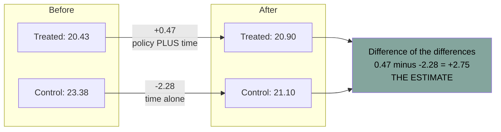
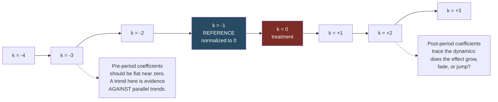

# Difference in Differences

Source: Hansen, *Econometrics*, chapter 18.

## The idea

A policy changes for one group and not another. Comparing the treated group before and after mixes the policy effect with whatever else was happening over time. Comparing treated and control after the change mixes the policy effect with pre-existing differences between the groups.

**Difference in differences** takes the difference of those two differences, which cancels both problems — under an assumption.

## The canonical example: Card and Krueger (1994)

New Jersey raised its minimum wage from $4.25 to $5.05 in 1992. Pennsylvania did not. Card and Krueger surveyed fast-food restaurants in both states before and after.

Average full-time-equivalent employment per restaurant:

| | New Jersey | Pennsylvania | Difference |
| --- | --- | --- | --- |
| Before | 20.43 | 23.38 | -2.95 |
| After | 20.90 | 21.10 | -0.20 |
| **Difference** | **+0.47** | **-2.28** | **+2.75** |

New Jersey employment rose slightly (+0.5); Pennsylvania employment fell (-2.3). The difference in differences is **+2.75** employees per restaurant — the minimum wage increase is associated with *higher* employment, contradicting the textbook prediction.

Read the two components:

- The "difference estimator" alone (+0.47 in NJ) attributes all time variation to the policy — it has no counterfactual.
- Using Pennsylvania as a control asserts that, absent the policy, NJ employment would have moved like PA employment.



The control group's change is the estimate of "what would have happened anyway". Subtracting it is the whole method — and **parallel trends** is the claim that this subtraction is valid.

## The regression form

With `Stateᵢ` = 1 for New Jersey, `Timeₜ` = 1 for after, and `Dᵢₜ = Stateᵢ × Timeₜ`:

```
Yᵢₜ = β₀ + β₁ Stateᵢ + β₂ Timeₜ + θ Dᵢₜ + εᵢₜ
```

| | New Jersey | Pennsylvania | Difference |
| --- | --- | --- | --- |
| Before | `β₀ + β₁` | `β₀` | `β₁` |
| After | `β₀ + β₁ + β₂ + θ` | `β₀ + β₂` | `β₁ + θ` |
| **Difference** | `β₂ + θ` | `β₂` | **`θ`** |

`θ` is exactly the difference in differences. Card-Krueger estimates:

```
Yᵢₜ = 23.4 - 2.9·State - 2.3·Time + 2.75·D + ε
      (1.4)  (1.5)       (1.2)      (1.34)
```

t-statistic just above 2, p-value 0.04.

Note this 2×2 specification is **saturated** in the two dummies, so it is necessarily the correct conditional expectation — no functional form assumption is being made. That guarantee is lost as soon as you have more groups, more periods, or continuous controls.

## Equivalence with two-way fixed effects

The same regression can be written as

```
Yᵢₜ = θ Dᵢₜ + uᵢ + vₜ + εᵢₜ
```

with unit fixed effects `uᵢ` and time fixed effects `vₜ`. In a balanced panel with a treatment that does not vary within state, restaurant-level fixed effects give the same answer as state-level ones. Estimating with restaurant fixed effects and a time dummy reproduces `θ̂ = 2.75` and its standard error 1.34 exactly.

This is why DiD generalizes so naturally: two-way fixed effects handles many units, many periods, staggered adoption, and continuous treatments — all with the same regression. See [[13 - Panel Data]].

## Identification

Hansen's Theorem 18.1 states sufficient conditions for `θ` to be the average causal effect:

1. The model `Yᵢₜ = θDᵢₜ + Xᵢₜ'β + uᵢ + vₜ + εᵢₜ` is correctly specified (all trends and interactions properly included).
2. The two-way within-transformed regressors have a nonsingular design matrix (treatment must vary across both time and units).
3. `E[Xᵢₜεᵢₛ] = 0` for all `t, s` — strict exogeneity of the controls.
4. Conditional on the controls, `Dᵢₜ` is statistically independent of `εᵢₛ` for all `t, s`.

Condition 4 is the substantive one, and it is doing several jobs at once:

- **The policy was not enacted in response to the outcome.** No reverse causality at the policy level.
- **No anticipation.** Outcomes in the pre-period were not already adjusting to the expected policy.
- **No coincident shocks.** Nothing else that differentially affected NJ vs PA employment in 1992.

Hansen assesses the Card-Krueger case: the policy was adopted two years before it took effect, during an expansion, and by the time it bound the economy was in recession with serious talk of repeal — so it is credible that 1992 employment decisions were not made in anticipation. However, the authors **do not** discuss whether other events differentially hit New Jersey and Pennsylvania in 1992, and Hansen calls this "the greatest weakness in their identification argument".

That is the right level of scrutiny to apply to any DiD paper.

The colloquial name for condition 4 is **parallel trends**: absent treatment, treated and control groups would have followed the same path.

## Homogeneous treatment and control effects

The basic model imposes two restrictions that deserve testing:

**Common treatment effect.** If `θ` differs across treated units, the model is misspecified. Test by adding interactions of treated-unit dummies with the time index and testing their joint exclusion. Card-Krueger split NJ into three regions; the test gives p = 0.60 — no evidence of heterogeneity.

Heterogeneous treatment effects are not a violation of the framework, but they make interpretation much harder, and a model that wrongly imposes homogeneity is inconsistent.

**Common control effect.** More serious. If the control group's change differs across control units, there is no coherent "control trend" to subtract, and the whole strategy is undermined. Card-Krueger's two Pennsylvania regions differ by a t-statistic of 1.2 (p = 0.23) — not significant, so the control effect looks homogeneous.

Hansen: "if a test for equal control effects rejects the hypothesis of homogeneous control effects this should be taken as evidence against interpretation of the difference-in-difference parameter as a treatment effect."

## A strong design: DiTella and Schargrodsky (2004)

Does police presence reduce crime? Police are allocated in anticipation of crime, so the raw correlation is uninformative. The authors used a shock: after a July 1994 terrorist attack on a Jewish center in Buenos Aires, the government assigned police protection to all Jewish and Muslim buildings within two weeks. Car thefts per block, before and after, for blocks with (37) and without (839) a Jewish institution:

| | Same block | Not same block | Difference |
| --- | --- | --- | --- |
| April-June | 0.112 | 0.095 | -0.017 |
| August-December | 0.035 | 0.105 | +0.070 |
| **Difference** | **-0.077** | **+0.010** | **-0.087** |

Police presence reduced car thefts by 0.087 per block per month, about a 78% reduction.

Why this is a strong design:

- The shock (a terrorist attack) is plainly unrelated to auto theft.
- The government response was mechanical (protect religious buildings), not crime-targeted.
- Pre-attack theft rates are similar across treatment and control.
- The effect is uniform across all five post-attack months (test of homogeneity: p = 0.81), which is striking with only 37 treated blocks.
- No plausible coincident event.

Compare to the Card-Krueger case, where the exogeneity argument is weaker. The lesson: DiD credibility comes from the *story about the shock*, not from the regression.

## Trend specification

If the outcome is trended and trends differ across units, the basic model is misspecified and `θ̂` is biased by omitted variables.

The generalization is **unit-specific linear trends**:
```
Yᵢₜ = θDᵢₜ + Xᵢₜ'β + uᵢ + vₜ + t·wᵢ + εᵢₜ
```
Identified as long as `T ≥ 4`.

Implementation: with small `N`, include explicit unit-dummy × trend interactions. With large `N`, use residual regression — detrend each variable within each unit, then regress the detrended variables on each other.

**Hansen's cautionary example (Bernheim, Meer, Novarro 2016)**, on whether relaxing Sunday alcohol-sale restrictions raised consumption. State-year panel, 47 states, 1970-2007. Basic model:

```
Yᵢₜ = 0.011·OnHours + 0.003·OffHours - 0.013·UR + ...
      (0.003)         (0.003)          (0.004)
```

Add state-specific linear trends:

```
Yᵢₜ = 0.000·OnHours + 0.002·OffHours - 0.015·UR + t·wᵢ + ...
      (0.002)         (0.002)          (0.004)
```

The headline coefficient drops to zero. The authors dismissed the trended specification as demanding too much of the data — but Hansen points out the standard errors actually *fell*, so the effects are better identified, not worse. Since `OnHours` is trended and trends vary by state, omitting the trend interaction induced omitted variable bias. **The trended specification is the right one.**

Practical rule: check whether your outcome and treatment are trended and whether trends differ by unit. Plot them. Report both specifications.

## "Check your code": Donohue and Levitt (2001)

The famous abortion-and-crime paper regressed log arrests on abortion rates with state fixed effects, cohort-year interactions, and state-year interactions — a triple-difference identifying off within-state cross-cohort variation. Reported `β = -0.028`, implying legalized abortion reduced crime by 15-25%.

Foote and Goetz (2008), attempting to replicate, found the code **inadvertently omitted the state-year interactions**. Re-estimated correctly, `β = -0.010` — still statistically different from zero, but the substantive impact is cut to roughly a third.

Hansen draws two lessons: include the appropriate controls (the authors' *intended* specification was right), and **check your code**. "Computation errors are pervasive in applied economic work... The solution is to be pro-active and vigilant." See [[19 - Applied Workflow and Common Mistakes]].

## Inference — the traps

**Cluster at the aggregate level.** Bertrand, Duflo and Mullainathan (2004) demonstrated the problem by taking real CPS data and adding a randomly generated "policy" regressor. With non-clustered standard errors, the fake variable came out significant far too often. With clustering at the state level, false rejections disappeared. This is why economics now routinely clusters at the state level.

The mechanism is the Moulton inflation factor `1 + ρ(N-1)`: even a tiny within-group correlation produces large variance inflation when groups are big. See [[06 - Standard Errors and Clustering]].

**But clustering has limits, and they bite hardest exactly here:**

1. **The effective sample size is the number of clusters.** With U.S. states, `G ≤ 51`. You are estimating the covariance matrix from at most 51 observations. If you estimate more than 51 coefficients it is not even full rank.

2. **Card-Krueger cannot be clustered by state.** There are only two states. Clustering at the level of treatment assignment is *impossible* here, which casts doubt on applications involving a handful of aggregate units generally.

3. **A single treated unit is the worst case.** If only one state adopted the policy, the clustered covariance estimator is singular; the standard error for the treatment coefficient is computed from a single cluster's deviation and is "incorrect and highly biased towards zero". You will report a small standard error on an estimate you know almost nothing about. Algebraically this is the sparse-dummy problem from [[06 - Standard Errors and Clustering]]. See Conley and Taber (2011) for remedies.

4. **Few clusters generally**: use the wild cluster bootstrap. See [[09 - Bootstrap and Resampling]].

## Event studies

The modern default presentation. Instead of a single post-treatment dummy, estimate a coefficient for each period relative to treatment:

```
Yᵢₜ = Σ_{k ≠ -1} θ_k · 1{t - Eᵢ = k} + uᵢ + vₜ + εᵢₜ
```

where `Eᵢ` is unit `i`'s treatment date and `k = -1` is the omitted reference period. Plot `θ̂_k` with confidence bands.



What it shows:

- **Pre-treatment coefficients** should be near zero. Non-zero pre-trends are evidence against parallel trends (and against no-anticipation).
- **Post-treatment coefficients** trace the dynamics — does the effect grow, fade, or jump?

Caveats: pre-trend tests have low power, so "we cannot reject flat pre-trends" is weak reassurance; and the pre-period coefficients are estimated relative to an arbitrary reference period, so the visual can mislead.

## Staggered adoption (the modern literature)

When units adopt treatment at different times, the standard two-way fixed effects estimator is **not** a clean average of treatment effects. Goodman-Bacon (2021) showed that TWFE is a weighted average of all possible 2×2 DiD comparisons, and — critically — some of those comparisons use **already-treated units as controls**. If treatment effects change over time, those comparisons get **negative weights**, and the TWFE estimate can have the wrong sign even when every unit's true effect is positive.

Hansen's chapter predates the full resolution of this literature, but flags the underlying issue: the basic model imposes a common treatment effect, and "a model which incorrectly imposes a homogeneous treatment effect is misspecified and produces inconsistent estimates."

Modern estimators that fix this: Callaway-Sant'Anna, Sun-Abraham, Borusyak-Jaravel-Spiess, de Chaisemartin-D'Haultfœuille. All build group-time average treatment effects using only never-treated or not-yet-treated units as controls, then aggregate with explicit, non-negative weights.

**If your design has staggered adoption, do not report bare TWFE.** Report a modern estimator, and use the Goodman-Bacon decomposition to show where your identifying variation comes from.

## Practical checklist

1. Plot the raw series for treated and control groups. If the picture is not convincing, no regression will be.
2. Show the 2×2 table of means before showing regressions.
3. Present an event study with pre-period coefficients.
4. Test for homogeneous treatment effects and, more importantly, homogeneous control effects.
5. Check trend specification: unit-specific trends where warranted.
6. Cluster at the level of treatment assignment; report `G`; use the wild cluster bootstrap if `G` is small.
7. If adoption is staggered, use a modern estimator.
8. Name the most credible threat — a coincident shock that hit treated units differentially — and address it.
9. Check your code.

Related:

- [[10 - Causality and Identification]]
- [[13 - Panel Data]]
- [[06 - Standard Errors and Clustering]]
- [[09 - Bootstrap and Resampling]]
- [[19 - Applied Workflow and Common Mistakes]]
