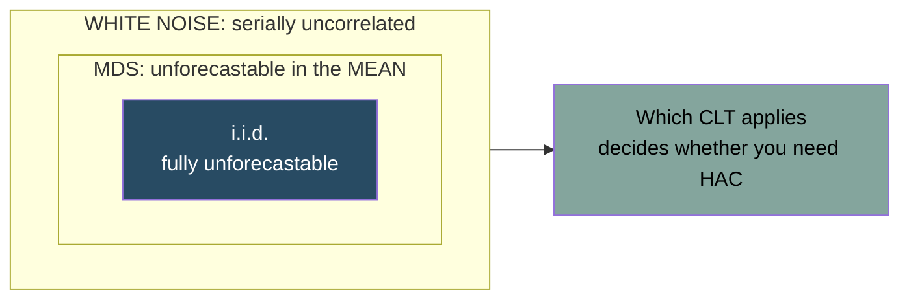

# Time Series

Source: Hansen, *Econometrics*, chapters 14 (univariate), 15 (multivariate), 16 (non-stationary).

## What changes when data are ordered

In cross-sections we assume independent observations. In time series, observation `t` is correlated with observation `t-1` by construction — that dependence is the object of interest, not a nuisance. Two things must change:

1. **The law of large numbers and CLT need new conditions.** i.i.d. is replaced by *stationarity* plus an *ergodicity* or *mixing* condition — roughly, "dependence dies out as observations get further apart".
2. **Standard errors may need to account for serial correlation.** When they do, robust-to-heteroskedasticity is not enough. But — see below — this is not automatic: a correctly specified autoregression does *not* need HAC.

## Stationarity

A series is **strictly stationary** if the joint distribution of any block of observations is unchanged by shifting the block in time.

**Covariance (weak) stationarity** is the working definition: constant mean, constant variance, and autocovariance `cov(Yₜ, Yₜ₋ₖ) = γ(k)` depending only on the lag `k`, not on `t`.

**Why it matters**: without stationarity, "the mean" is not a well-defined thing to estimate. Sample averages of a trending or exploding series do not converge to anything useful, and regressions between two trending series produce **spurious regression** — high `R²`, huge t-statistics, no relationship.

**Ergodicity** adds that time averages converge to population averages, which is what makes estimation from a single realization possible at all. Formally a series is ergodic if all invariant events are trivial; the usable intuition is that sample paths pass through all parts of the space rather than getting stuck in a subregion. `Yₜ = Z` for a single random `Z` is strictly stationary but *not* ergodic — the sample mean converges to `Z`, not to `E[Z]`.

**Ergodic theorem** (Theorem 14.9): if `Yₜ` is strictly stationary, ergodic, and `E‖Y‖ < ∞`, then `Ȳ →p μ`. This is the time-series WLLN. The moment condition is exactly the same as under i.i.d. sampling — dependence costs you nothing there.

The variance of the sample mean shows where dependence does cost you:
```
var[Ȳ] = σ²/n + (2/n) Σ_{ℓ=1}^{n} (1 - ℓ/n) γ(ℓ)
```
the i.i.d. variance plus a weighted Cesàro mean of the autocovariances. Ergodicity forces that second term to zero, which is what makes the sample mean consistent.

**Mixing** is a stronger, more tractable condition. The strong mixing coefficients are
```
α(ℓ) = sup |P[A ∩ B] - P[A]P[B]|
```
over events `A` in the past up to `t - ℓ` and `B` in the future from `t`. `Yₜ` is **strong mixing** if `α(ℓ) → 0`. Mixing implies ergodicity. Hansen's illustration is Halmos's martini: pour vermouth on gin and stir; if the stirring is mixing, the vermouth spreads evenly and the two become asymptotically independent.

Linear processes (AR, ARMA) are mixing provided the innovations have a smooth density — Andrews (1984) showed an AR(1) with two-point discrete innovations is *not* strong mixing, because observing `Yₜ` lets you deduce the entire shock history.

## Three kinds of shock, properly nested

A distinction Hansen is careful about and most treatments blur:

```
i.i.d.  ⊂  MDS  ⊂  white noise
```

- **i.i.d.** — fully unforecastable. No function of the past predicts anything.
- **Martingale difference sequence (MDS)**: `E[eₜ | ℱₜ₋₁] = 0`. Unforecastable **in the mean**, but other moments may be forecastable. `eₜ = uₜuₜ₋₁` with `uₜ` i.i.d. normal is an MDS and is not i.i.d. — its squares are serially correlated. Conditional heteroskedasticity (ARCH/GARCH) lives here.
- **White noise**: mean zero, finite variance, `cov(eₜ, eₜ₋ₖ) = 0`. Serially *uncorrelated* but possibly forecastable in the mean. `eₜ = uₜ + uₜ₋₁uₜ₋₂` is white noise but not an MDS.



ARCH and GARCH live in the MDS ring: unforecastable in the mean, very much forecastable in the variance.

An MDS is always white noise (Theorem 14.10); the reverse fails. This nesting is what determines which CLT applies:

```
MDS CLT (Thm 14.11):  uₜ strictly stationary, ergodic MDS, E[uₜuₜ'] = Σ < ∞
                      ⟹ n^{-1/2} Σuₜ →d N(0, Σ)

Mixing CLT (Thm 14.15): uₜ strictly stationary, E[uₜ] = 0, E‖uₜ‖^r < ∞ for r > 2,
                        Σ α(ℓ)^{1-2/r} < ∞  ⟹ n^{-1/2} Σuₜ →d N(0, Ω)
```

The MDS CLT needs only two moments — the same as Lindeberg-Lévy. The mixing CLT needs `r > 2` moments plus a summability condition, and delivers the **long-run variance** `Ω = Σ_{ℓ=-∞}^{∞} Γ(ℓ)` in place of `Σ`. Which one you get is exactly what decides whether you need HAC standard errors.

## Growth rates and differences

Practical preliminaries that matter more than they look:

```
ΔYₜ = Yₜ - Yₜ₋₁                              first difference
Δ_sYₜ = Yₜ - Yₜ₋ₛ                            annual change, frequency s
Qₜ = 100(Yₜ/Yₜ₋₁ - 1) ≈ 100 Δlog Yₜ          one-period growth rate
Aₜ = 100((Yₜ/Yₜ₋₁)^s - 1)                    annualized growth rate
Gₜ = 100(Yₜ/Yₜ₋ₛ - 1) ≈ 100 Δ_s log Yₜ       year-on-year growth
```

Hansen's recommendation: **use one-period growth rates or differenced logarithms, not annualized growth rates.** Annualization is convenient for reporting but is a highly nonlinear transformation and unnatural for statistical analysis. Differenced logs are preferred when a model mixes log-levels and growth rates, because then the model is linear in all variables.

## Autocorrelation

The **autocorrelation function (ACF)** is `ρ(k) = γ(k)/γ(0)`. The **partial autocorrelation function (PACF)** is the correlation between `Yₜ` and `Yₜ₋ₖ` after removing intermediate lags.

Reading the pair is the classical identification method:

| Pattern | Suggests |
| --- | --- |
| ACF decays geometrically, PACF cuts off after lag `p` | AR(`p`) |
| ACF cuts off after lag `q`, PACF decays | MA(`q`) |
| Both decay | ARMA |
| ACF decays extremely slowly, near 1 for many lags | Unit root / non-stationarity |

## Core models

**Wold decomposition** (Theorem 14.17) — the foundational result, and the reason linear models are used at all. Any covariance-stationary process with non-zero projection-error variance can be written

```
Yₜ = μₜ + Σ_{j=0}^{∞} bⱼeₜ₋ⱼ,   b₀ = 1,  Σbⱼ² < ∞
```

where `eₜ` are the **white noise projection errors** `Yₜ - P_{t-1}[Yₜ]` and `μₜ` is the **deterministic component** (the part perfectly predictable from the infinite past). A series is **non-deterministic** if `μₜ = μ`, a constant, which is what applied work assumes. So: *any* covariance-stationary process has a linear representation, which justifies linear models as approximations. The limitation is that a nonlinear model may still fit better.

**Lag operator**: `LYₜ = Yₜ₋₁`, so the Wold form is `Yₜ = μ + b(L)eₜ` with `b(z) = b₀ + b₁z + b₂z² + ...`.

**Autoregression AR(p)**:
```
Yₜ = α₀ + α₁Yₜ₋₁ + ... + α_pYₜ₋ₚ + eₜ,    α(L)Yₜ = α₀ + eₜ
α(z) = 1 - α₁z - ... - α_p z^p             autoregressive polynomial
```

**Stationarity** (Theorem 14.23): the AR(p) is absolutely convergent, strictly stationary and ergodic iff all roots of `α(z)` lie **outside the unit circle**. Equivalently, the eigenvalues of the companion matrix are less than one in absolute value.

- AR(1): `|α₁| < 1`. Moments `E[Y] = α₀/(1-α₁)`, `var[Y] = σ²/(1-α₁²)`, `ρ(k) = α₁^k`.
- AR(2): stationary iff `α₁ + α₂ < 1`, `α₂ - α₁ < 1`, `α₂ > -1` — a **triangle** in `(α₁, α₂)` space. Above the parabola `α₁² + 4α₂ = 0` the roots are real; below it they are complex, and the autocorrelations show **damped oscillations**. This is why an AR(2) can produce cyclical behavior an AR(1) never can.

The AR(1) coefficient is the persistence, and the half-life of a shock is `log(0.5)/log(α₁)` periods.

**Impulse response function.** Inverting the AR polynomial gives `Yₜ = μ + b(L)eₜ` with `b(z) = α(z)⁻¹`. The coefficients `bⱼ = ∂Yₜ₊ⱼ/∂eₜ` are the IRF, computed by the recursion

```
b₀ = 1,  b₁ = α₁b₀,  b₂ = α₁b₁ + α₂b₀,  ...,  bⱼ = α₁bⱼ₋₁ + ... + α_p bⱼ₋ₚ
```

Often scaled to a one-standard-deviation shock: `IRFⱼ = σbⱼ`.

**Moving average MA(q)**: `Yₜ = μ + eₜ + θ₁eₜ₋₁ + ... + θ_qeₜ₋q`. Moments: `var[Y] = (Σθⱼ²)σ²`, `γ(k) = (Σ_{j=0}^{q-k}θ_{j+k}θⱼ)σ²` for `k ≤ q`, and **exactly zero for `k > q`**. Estimated by MLE since the errors are unobserved.

**ARMA(p,q)**: `α(L)Yₜ = α₀ + θ(L)eₜ`. Stationary and ergodic if all roots of `α(z)` lie outside the unit circle. **ARIMA(p,d,q)**: `α(L)(1-L)^d Yₜ = α₀ + θ(L)eₜ`.

### Identification — MA and ARMA coefficients are generally not identified

This is a real trap and rarely stated plainly. For the MA(1) `Yₜ = eₜ + θeₜ₋₁`,

```
ρ(1) = θ/(1 + θ²)
```

and substituting `ω = 1/θ` gives **the same** `ρ(1)`. `θ = 1/2` and `θ = 2` both give `ρ(1) = 2/5`. There is no empirical way to tell them apart. For MA(2) there are four observationally indistinguishable models. The standard fix is to restrict attention to the **invertible** root, which is exactly what the Wold decomposition picks out.

ARMA has a worse problem: **cancelling roots**. In `(1-αL)Yₜ = (1+θL)eₜ`, if `α = -θ` the model collapses to `Yₜ = eₜ`, so a whole continuum of parameter values is identical. The literature assumes no cancelling roots, which as Hansen notes "is not really a solution to the identification problem". Be wary of heavily parameterized ARMA models.

**AR models, by contrast, are identified** (Theorem 14.27/14.28): so long as `σ² > 0` (the series is not purely deterministic), `Q = E[XₜXₜ']` is positive definite and `α` is unique — and this holds even for an *approximating* AR(p) defined by linear projection, whether or not the true process is an AR(p). This is a strong argument for preferring autoregressions in applied work.

**Lag selection**: Hansen recommends **AIC**, in the regression form
```
AIC(p) = n log σ̂²(p) + 2p
```
One practical trap: the sample available changes with `p` (more lags need more initial conditions). Fix an upper bound `p̄`, reserve the first `p̄` observations as initial conditions, and estimate every model on that same unified sample — otherwise the likelihoods are not comparable. See [[18 - Model Selection and Machine Learning]].

Hansen is dismissive of using *hypothesis tests* to pick lag order: "tests are designed to provide answers to scientific questions rather than being designed to select models with good approximation properties."

## Estimation and inference for autoregressions

OLS on `Yₜ = Xₜ'α + eₜ` with `Xₜ = (1, Yₜ₋₁,...,Yₜ₋ₚ)'`.

**Consistency** (Theorem 14.29) needs only strict stationarity, ergodicity, non-determinism, and `E[Yₜ²] < ∞`. The series need not actually be an AR(p) — `α` is then the linear projection coefficient.

**Asymptotic normality under correct specification** (Theorem 14.30): if `eₜ` is an MDS with finite fourth moments,
```
√n(α̂ - α) →d N(0, V),   V = Q⁻¹ΣQ⁻¹,   Σ = E[XₜXₜ'eₜ²]
```

**This is exactly the cross-section formula.** The MDS assumption makes `Xₜeₜ` a martingale difference sequence, so the MDS CLT applies and no long-run variance appears.

**The practical consequence, which contradicts common practice**: for a correctly specified autoregression, ordinary **heteroskedasticity-robust standard errors are valid**. You do *not* need Newey-West.

Under homoskedasticity `V⁰ = σ²Q⁻¹`, and for the AR(1) without intercept this simplifies beautifully:
```
√n(α̂₁ - α₁) →d N(0, 1 - α₁²)
```
The variance depends only on `α₁` and shrinks as persistence rises — more signal, more precision. Note it is *non-similar* (the variance depends on the parameter being tested), which means asymptotic inference is less accurate than nominal levels suggest.

Hansen's verdict on the homoskedastic case matches his cross-section view: there is no reason to expect homoskedasticity, so use robust theory. He calls it "unfortunate" that many time-series textbooks and software packages default to (or only offer) the homoskedastic formulas.

**When you do need HAC**: if the AR(p) is **misspecified** — including simply getting the lag order wrong — the errors are white noise projection errors rather than an MDS, the scores `Xₜeₜ` are serially correlated, and the mixing CLT applies instead:
```
√n(α̂ - α) →d N(0, Q⁻¹ΩQ⁻¹),   Ω = Σ_{ℓ=-∞}^{∞} E[Xₜ₋ℓXₜ'eₜeₜ₋ℓ]
```
So HAC is insurance against misspecification, not a routine requirement.

## Inference with serial correlation

For a regression with time-series data, the OLS estimator is still consistent under mild conditions, but its variance is

```
V = Q⁻¹ Ω Q⁻¹     with  Ω = Σ_{k=-∞}^{∞} E[XₜeₜXₜ₋ₖ'eₜ₋ₖ]
```

The **long-run variance** `Ω` sums autocovariances across all lags, not just the contemporaneous term.

Set `uₜ = Xₜeₜ` and `Γ(ℓ) = E[uₜ₋ℓuₜ']`. The naive truncated estimator

```
Ω̂_M = Σ_{ℓ=-M}^{M} Γ̂(ℓ),      Γ̂(ℓ) = (1/n) Σ ûₜ₋ℓûₜ'
```

has two defects: it changes non-smoothly with `M`, and **it can fail to be positive semi-definite** — for scalar `uₜ` and `M = 1`, `Ω̂₁ = γ̂(0)(1 + 2ρ̂(1))`, which is negative whenever `ρ̂(1) < -1/2`. A negative variance estimate produces a complex standard error, which is a common and baffling computational mishap.

**Newey-West** fixes both by down-weighting the higher autocovariances with the Bartlett kernel:

```
Ω̂_nw = Σ_{ℓ=-M}^{M} (1 - |ℓ|/(M+1)) Γ̂(ℓ)
```

This is guaranteed positive semi-definite and smooth in `M`. Consistency (Theorem 14.34) requires `M → ∞` with `M³/n = O(1)` — informally, `M` must grow no faster than `n^{1/3}`, and "should be much smaller than `n`".

**Bandwidth.** Andrews (1991) showed the MSE-optimal rate is `M = Cn^{1/3}`, with

```
M = ( 6ρ²/(1-ρ²)² )^{1/3} n^{1/3}
```

where `ρ` is a serial correlation parameter (for scalar `uₜ`, its first autocorrelation) either estimated or set to a default. **At `ρ = 0.5` this gives `M = 1.4 n^{1/3}`, a useful benchmark.** Choice of *kernel* matters much less than choice of `M`.

Practical rule: report the bandwidth and kernel, and be explicit about whether you are using HAC because you believe the model is an approximation (usually yes) or out of habit.

## Testing for serial correlation

**No serial correlation at all**: estimate an AR(p) and Wald-test `α₁ = ... = α_p = 0`. Use the ordinary robust covariance estimator (14.48), **not** Newey-West — under the null there is no serial correlation to correct for. Choose `p` equal to the seasonal frequency `s`: 4 lags for quarterly, 12 for monthly.

**Omitted serial correlation in an AR(p)**: the natural two-step approach (save residuals, regress them on their own lags, Wald test) is **wrong** — the two-step procedure distorts the Wald statistic away from chi-square. The clean route: testing AR(p) against an AR(q) error is algebraically equivalent to testing AR(p) against **AR(p+q)**, implemented as a Wald test on the coefficients of `Yₜ₋ₚ₋₁,...,Yₜ₋ₚ₋q`. For `q = 1` it is a simple t-test on the `(p+1)`-th lag.

## Forecasting

The optimal point forecast under squared loss is the conditional expectation `E[Yₜ₊ₕ | information at t]`.

Practical machinery:

- **Direct vs iterated multi-step forecasts.** Iterated: fit a one-step model and iterate forward. Direct: regress `Yₜ₊ₕ` on time-`t` information. Iterated is more efficient if the model is right; direct is more robust to misspecification.
- **Forecast intervals** need the variance of the multi-step forecast error, which accumulates across horizons.
- **Evaluation**: out-of-sample RMSE on a hold-out period, using a rolling or expanding window. In-sample fit is nearly worthless for forecast comparison.
- **Diebold-Mariano test** compares the predictive accuracy of two forecasts formally.
- Forecast **combination** (simply averaging forecasts) very often beats individual models. This is one of the most robust empirical findings in the field.

**Structural breaks**: a model estimated over one regime forecasts badly in another. Test with Chow tests (known break date) or Andrews' sup-Wald test (unknown break date, non-standard critical values). Rolling-window estimation is a pragmatic partial answer.

## Multivariate time series

**Vector autoregression (VAR)**:
```
Yₜ = A₁Yₜ₋₁ + ... + AₚYₜ₋ₚ + eₜ
```
where `Yₜ` is a vector. Each equation is estimated by OLS (they share regressors, so system estimation gains nothing).

Uses:

- **Granger causality**: does `X` help predict `Y` beyond `Y`'s own past? A Wald test on the lags of `X` in the `Y` equation. Note this is a statement about *predictability*, not causality in the [[10 - Causality and Identification]] sense. Two variables both driven by an unobserved anticipation can Granger-cause each other with no structural link.
- **Local projections** (Jordà): estimate the impulse response at horizon `h` by regressing `Yₜ₊ₕ` directly on the shock, one regression per horizon. More robust to misspecification than iterating a VAR forward, at some cost in efficiency, and now the standard alternative in applied macro.
- **External-instrument (proxy) SVARs**: identify a structural shock using an outside instrument correlated with it, rather than by ordering restrictions.
- **Impulse response functions**: the dynamic path of `Y` after a shock. Requires identifying which shocks are which — a Cholesky (recursive) ordering, sign restrictions, or external instruments. The identification problem here is exactly as serious as elsewhere in econometrics, and the ordering choice is a substantive assumption.
- **Forecast error variance decomposition**: how much of the variance of one variable at each horizon is attributable to each shock.

## Non-stationarity and unit roots

A **unit root** process (random walk) `Yₜ = Yₜ₋₁ + eₜ` has:

- Variance growing linearly with `t` — no fixed mean to converge to.
- Shocks that are permanent, never dying out.
- Non-standard asymptotics: the OLS coefficient converges at rate `T` (superconsistent), and its t-statistic has a Dickey-Fuller distribution, not normal.

**Spurious regression**: regress one independent random walk on another and you typically get a large `R²` and a t-statistic that grows with `T`, with no relationship whatever. This is the reason unit-root testing exists.

**Tests**:

- **Dickey-Fuller / Augmented Dickey-Fuller (ADF)**: null is a unit root. Non-standard critical values, and the version (with/without constant, with/without trend) matters.
- **Phillips-Perron**: nonparametric correction for serial correlation.
- **KPSS**: null is *stationarity* — the reverse. Running both and comparing conclusions is common practice.

Practical caveat: unit-root tests have low power against persistent-but-stationary alternatives (`φ = 0.95` versus `φ = 1`). Do not treat a failure to reject as proof of a unit root. Economic reasoning about whether shocks should be permanent is at least as informative as the test.

## Cointegration

Two series can each be non-stationary while a linear combination of them is stationary. Then they are **cointegrated**, and the stationary combination is a long-run equilibrium relationship they are tied to.

Examples: consumption and income; spot and futures prices of the same asset; prices of the same security on two venues; short and long interest rates.

**Error correction model (ECM)** — the Granger representation theorem says cointegration is equivalent to an ECM:
```
ΔYₜ = α(Yₜ₋₁ - βXₜ₋₁) + (short-run dynamics) + eₜ
```
The term in parentheses is last period's deviation from equilibrium; `α < 0` is the speed at which the system corrects back. This is the natural regression form for pairs trading and long-run relationships generally.

**Estimation and testing**:

- **Engle-Granger two-step**: regress `Y` on `X` (superconsistent), test the residual for a unit root using the ADF with *cointegration-specific* critical values (not the standard ones).
- **Johansen**: full-system maximum likelihood, tests the number of cointegrating relationships. Preferred when there are more than two series.

Warning: cointegration is a statement about a long-run *statistical* relationship. It is not causality, and cointegrating relationships can break down (regime change, structural break) exactly when it matters most.

## Volatility models

For financial and high-frequency data, conditional variance is itself time-varying and forecastable — **volatility clustering**.

- **ARCH(q)**: `σₜ² = ω + Σ αᵢ eₜ₋ᵢ²`.
- **GARCH(1,1)**: `σₜ² = ω + αeₜ₋₁² + βσₜ₋₁²`. Remarkably hard to beat empirically. Persistence is `α + β`, typically near 0.95-0.99 in daily data.
- Extensions: EGARCH and GJR-GARCH for asymmetry (negative returns raise volatility more), stochastic volatility models, and realized volatility from high-frequency data.

Estimated by MLE, usually with quasi-maximum-likelihood standard errors since the conditional distribution is rarely truly normal.

## Practical checklist

1. Plot the series. Always. Look for trends, level shifts, seasonality, changing volatility.
2. Test for stationarity, but weigh economic reasoning too.
3. If the series is non-stationary, either difference it or model the cointegrating relationship — do not regress levels on levels without a cointegration argument.
4. Use HAC standard errors; report kernel and bandwidth.
5. Evaluate forecasts out of sample, with a rolling window.
6. Check for structural breaks; a stable-looking in-sample fit is not evidence of stability.
7. When in doubt, benchmark against a random walk or a simple AR(1). Beating those honestly is harder than it looks.

Related:

- [[02 - Probability Foundations]]
- [[06 - Standard Errors and Clustering]]
- [[07 - Asymptotic Theory]]
- [[09 - Bootstrap and Resampling]]
- [[18 - Model Selection and Machine Learning]]
