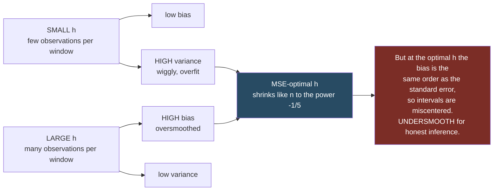
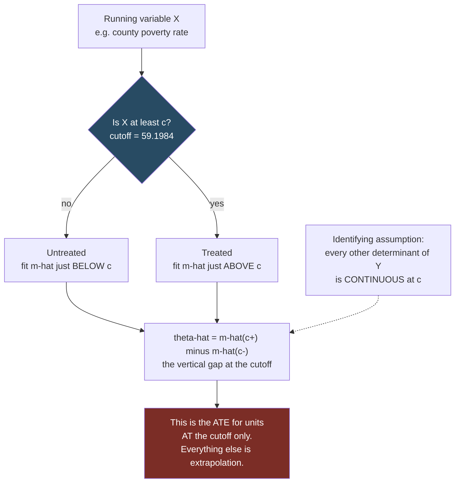

# Nonparametrics, Quantiles, and RDD

Source: Hansen, *Econometrics*, chapters 19-24.

Three related topics: estimating relationships without assuming a functional form, estimating effects on distributions rather than means, and one design (regression discontinuity) that is built on local nonparametric estimation.

## Why go nonparametric

A linear regression assumes the CEF is (approximately) a line. Nonparametric methods let the data determine the shape. The price is precision: you converge more slowly and you need more data, especially in higher dimensions.

For estimating a *density* rather than a regression function, the same machinery applies in a simpler setting — see [[23 - Nonparametric Density Estimation]], which is the best place to learn the bias-variance algebra.

## Kernel regression

To estimate `m(x) = E[Y | X = x]` at a point `x`, take a weighted average of nearby `Y` values:

**Nadaraya-Watson (local constant)**:
```
m̂(x) = Σᵢ K((Xᵢ - x)/h) Yᵢ  /  Σᵢ K((Xᵢ - x)/h)
```

- `K` is a **kernel** — a weight function that is large near zero and decays. Gaussian, Epanechnikov, uniform. The choice barely matters.
- `h` is the **bandwidth** — the width of the neighborhood. The choice matters enormously.

**Local linear regression** fits a weighted line rather than a weighted average in each neighborhood. It is strictly better and should be the default: it has smaller bias, especially at the edges of the data, where the local-constant estimator is badly biased because the neighborhood is one-sided. **Boundary bias is precisely why RDD uses local linear estimation.**

### The bandwidth is the whole ballgame




- Small `h`: few observations per neighborhood → low bias, high variance. Wiggly, overfit.
- Large `h`: many observations → low variance, high bias. Smooth, oversmoothed, approaching a global fit.

This is the bias-variance tradeoff made visible. The MSE-optimal bandwidth balances squared bias against variance and shrinks like `n^{-1/5}` for local linear estimation, giving a convergence rate of `n^{-2/5}` — slower than the parametric `n^{-1/2}`.

Selection methods: cross-validation (minimize leave-one-out prediction error), plug-in rules (estimate the unknown curvature that appears in the optimal formula), and Hansen's discussion of the fact that the MSE-optimal bandwidth is *not* the right bandwidth for constructing confidence intervals — at the optimal bandwidth the bias is of the same order as the standard error, so intervals are miscentered. The standard fixes are **undersmoothing** (use a smaller bandwidth than optimal) or **explicit bias correction** with a robust variance, which is what modern RDD packages implement.

### The curse of dimensionality

With `d` regressors the optimal rate degrades to `n^{-2/(4+d)}`. With `d = 5`, achieving the accuracy you would get from 100 observations in one dimension requires astronomically more data. Neighborhoods in high dimensions are almost empty.

This is why fully nonparametric methods are used mainly with one or two continuous variables, and why applied work relies on **semiparametric** models — flexible in the dimension you care about, parametric in the rest. The partially linear model `Y = D'θ + g(X) + e` is the canonical example, and it is exactly the structure that double machine learning exploits. See [[18 - Model Selection and Machine Learning]].

## Series and sieve regression

An alternative to kernels: approximate `m(x)` by a linear combination of basis functions and estimate by OLS.

Bases: polynomials, **splines** (piecewise polynomials joined smoothly at knots), B-splines, wavelets, Fourier terms.

```
m(x) ≈ β₀ + β₁ψ₁(x) + ... + βₖψₖ(x)
```

The number of terms `K` plays the role of the bandwidth: more terms means less bias and more variance. Choose by cross-validation or an information criterion.

Advantages over kernels: it is just OLS, so all the standard regression machinery (F tests, robust standard errors, fixed effects) applies directly; it handles multiple regressors more gracefully; and it is easy to impose additivity.

Practical advice: **splines beat high-order global polynomials.** A degree-10 polynomial oscillates wildly at the edges of the data (Runge's phenomenon). This matters concretely in RDD, where global high-order polynomial fits have been shown to produce spurious discontinuities.

## Quantile regression

Least squares estimates the conditional *mean*. Quantile regression estimates the conditional **quantile**:

```
Q_τ(Y | X) = X'β(τ)
```

Estimated by minimizing the asymmetrically weighted absolute loss (the "check function"):
```
min_b Σᵢ ρ_τ(Yᵢ - Xᵢ'b),    ρ_τ(u) = u(τ - 1{u < 0})
```

At `τ = 0.5` this is **median regression** (least absolute deviations).

Why it is useful:

- **Distributional effects.** A policy may not move the mean while sharply compressing the lower tail. Only quantile regression sees that.
- **Robustness.** Median regression is far less sensitive to outliers than the mean.
- **Heterogeneity.** `β(τ)` varying with `τ` is direct evidence that the effect is not uniform across the distribution.
- **Risk applications.** Value-at-Risk is a conditional quantile by definition.

Details: the objective is convex but non-differentiable, solved by linear programming. Asymptotic variance involves the conditional density of the error at the quantile, which is hard to estimate — so the **bootstrap** is the standard route to standard errors. See [[09 - Bootstrap and Resampling]].

**Interpretation warning**: `β(τ)` describes how the `τ`-quantile of the conditional distribution shifts with `X`. It does **not** track the same individuals across `τ` — the person at the 10th percentile with low `X` may not be the person at the 10th percentile with high `X`. "Quantile treatment effects" have a causal reading only under additional assumptions (rank invariance, or an instrument in the IV quantile framework).

## Regression discontinuity design (RDD)

The most credible non-experimental design in applied economics.

**Setup**: treatment is assigned by a rule based on a **running variable** `X` crossing a **cutoff** `c`:
```
D = 1{X ≥ c}
```

Examples: a scholarship for test scores above a threshold; a program for firms below an employee count; a class-size rule that triggers a split at 40 students; a regulatory tick-size regime that changes above a price level.

**The identifying idea**: units just below and just above the cutoff are nearly identical in everything except treatment. Compare them.

**Identification (Hahn, Todd and Van der Klaauw 2001; Hansen's Theorem 21.1).** Let `m₀(x) = E[Y₀|X=x]` and `m₁(x) = E[Y₁|X=x]` be the CEFs of the two potential outcomes. If `m₀` and `m₁` are **continuous at `c`**, then

```
θ̄ = m(c+) - m(c-)
```

is the conditional ATE at the cutoff, `θ̄ = E[θ | X = c]`.

The proof is three lines: the observed CEF is `m(x) = m₀(x)1{x<c} + m₁(x)1{x≥c}`, so continuity gives `m(c-) = m₀(c)` and `m(c+) = m₁(c)`, and the difference is `θ(c)`.

The assumptions are genuinely minimal. But note what is identified: **only the vertical distance at `c`**. Everything else in the picture — the counterfactual `m₁` below the cutoff and `m₀` above it — is not identified. Using `θ̄` for units away from the cutoff is extrapolation. High internal validity, narrow external validity, by construction.

**Why estimation must be nonparametric.** If you impose a parametric form (say linear) on each side, the best-fitting approximations for `x < c` and `x ≥ c` will *generically* differ at `c` even when the true CEF is continuous. A parametric fit therefore manufactures a discontinuity out of curvature. Nonparametric treatment is essential to avoid falsely labelling nonlinearity as a discontinuity.

**Fuzzy RDD.** Crossing the cutoff changes the *probability* of treatment `p(x) = P[D=1 | X=x]` rather than determining it. Hansen's Theorem 21.2: if `m₀` and `m₁` are continuous at `c`, `p(x)` is discontinuous at `c`, **and `D` is independent of `θ` for `X` near `c`**, then

```
θ̄ = ( m(c+) - m(c-) ) / ( p(c+) - p(c-) )
```

The extra independence condition is strong: it rules out individuals with high treatment effects being more likely to select into treatment. (Hahn, Todd and Van der Klaauw use the even stronger assumption that `θ` is constant.) This is the same structure as a Wald IV estimator with `1{X ≥ c}` as the instrument — and it inherits the weak-instrument problem: **a small discontinuity in `p(x)` means weak identification**. See [[11 - Instrumental Variables]].



### Estimation

Run **local linear regression separately on each side** of the cutoff with bandwidth `h`, and take the difference of the two fitted intercepts at `c`:

```
Zᵢ(x) = (1, Xᵢ - x)'
θ̂ = [β̂₁(c)]₁ - [β̂₀(c)]₁ = m̂(c+) - m̂(c-)
```

Local linear rather than Nadaraya-Watson because NW is badly biased at a boundary, and rather than series because series estimators have high variance at the boundary. Every point at the cutoff *is* a boundary point, which is why this matters here more than anywhere else.

**Kernel.** The **Triangular** kernel is efficient for boundary estimation and is what Hansen uses. Epanechnikov and Gaussian have similar efficiency. The **Rectangular** kernel costs about **3% in root AMSE** and buys the convenience that the estimator can be run in standard regression software — see the simple estimator below.

**Bias and variance:**
```
bias[θ̂] = (h²σ²_{K*}/2)( m''(c+) - m''(c-) )
var[θ̂]  = (R*_K/nh)( σ²(c+)/f(c+) + σ²(c-)/f(c-) )
```

Two practical implications Hansen draws from these:

1. **Use a common bandwidth on both sides.** When `m''` is continuous at `c` the two curvature terms cancel and the first-order asymptotic bias is *zero*.
2. **Undersmooth** — use a bandwidth smaller than AMSE-optimal. This costs variance and buys more honest inference.

**Do not use global high-order polynomials.** Hansen: some authors add polynomials to local linear as an appeal to "robustness"; "this should be discouraged", citing Gelman and Imbens (2019).

**Bandwidth selection.** There is no consensus, so compute several rules. Hansen's own recommendation:

1. Compute the **Fan-Gijbels rule-of-thumb** for several polynomial orders `q`. Fit `m(x) = β₀ + β₁x + ... + β_qx^q + β_{q+1}D` globally by least squares, form `m̂''(x)`, average its square, and use
```
h_rot = 0.58 ( σ̂²(ξ₂-ξ₁) / B̂ )^{1/5} n^{-1/5},   B̂ = (1/n)Σ(m̂''(Xᵢ)/2)²1{ξ₁ ≤ Xᵢ ≤ ξ₂}
```
The constant 0.58 is for a normalized (unit-variance) kernel; use 1.00 for the unnormalized Rectangular kernel and 1.42 for the unnormalized Triangular. Fan-Gijbels suggest `q = 4`. Watch the precision of the high-order coefficients — if they are noisy, so is the bandwidth.
2. Compute the **cross-validation** criterion and plot it against `h`. A flat CV curve tells you bandwidths are hard to rank.
3. Combine, then **reduce by roughly 25%** to undersmooth.

Cut-off-targeted rules (Imbens-Kalyanaraman 2012; Arai-Ichimura 2018; Calonico-Cattaneo-Titiunik 2020, implemented in `rdrobust`) aim at accuracy at `c` rather than globally. Hansen notes the trade-off: global rules are a simpler and hence less variable estimation problem, and noise in the bandwidth translates into noise in the RDD estimate.

**On robustness checks**, Hansen pushes back on standard practice: checking alternative bandwidths is "prudent, but narrowly so. A rather odd implication of the robustness craze is to desire results which do not change with bandwidths." If the regression function is genuinely nonlinear, estimates *should* change with `h`. What you should expect is that smaller `h` reveals more shape *and* more noise with wider bands, while larger `h` gives narrower bands at the cost of increased and uncertain bias.

### RDD with covariates

Covariates are **not needed for identification** — that is a direct implication of Theorem 21.1. They can improve precision by reducing equation error, so include relevant ones when available, but do not treat their absence as a flaw.

Hansen's preferred estimator is **Robinson's (1988)** semiparametric procedure, which is semiparametrically efficient (the alternatives on offer have no efficiency justification). Assume the partially linear form `E[Y_d | X=x, Z=z] = m_d(x) + β'z`. Then:

1. RDD local linear regression of `Yᵢ` on `Xᵢ` → fitted `m̂ᵢ`.
2. LL regression of each covariate `Z_kᵢ` on `Xᵢ` → fitted `ĝ_kᵢ`.
3. Regress `Yᵢ - m̂ᵢ` on `(Z₁ᵢ - ĝ₁ᵢ, ..., Z_kᵢ - ĝ_kᵢ)` → `β̂` and its standard errors.
4. Form `êᵢ = Yᵢ - Zᵢ'β̂`.
5. RDD local linear regression of `êᵢ` on `Xᵢ` → `m̂(x)`, `θ̂`, and standard errors.

Conventional inference is valid throughout.

### A simple RDD estimator you can run anywhere

Equivalent to local linear with an unnormalized Rectangular kernel: on the subsample with `|X - c| ≤ h`, estimate by OLS

```
Y = β₀ + β₁X + β₃(X - c)D + θD + e
```

`θ̂` is the conditional ATE and conventional regression standard errors are valid. Use the ROT bandwidth with the constant 1.00 rather than 0.58.

### Worked example: Head Start and childhood mortality

Ludwig and Miller (2007). In 1965 the U.S. federal government gave grant-writing assistance to the 300 poorest counties, selected on the 1960 census poverty rate — cut-off 59.1984%. Outcome: county mortality rate for Head-Start-related causes among children aged 5-9, 1973-1983.

The design is strong because the assignment rule was mechanical and the outcome is measured 8-18 years later.

| | Baseline | With covariates |
| --- | --- | --- |
| `θ̂` | -1.51 | -1.56 |
| `s(θ̂)` | (0.71) | (0.71) |
| % Black | | 0.027 (0.007) |
| % Urban | | -0.0094 (0.0046) |

p-value 3%. Against an untreated mortality rate of 3.3 per 100,000 at the cutoff, 1.5 fewer deaths is close to a **50% reduction**. Adding covariates barely moves `θ̂` — exactly as the identification theorem predicts — while changing the shape of `m̂(x)` away from the cutoff.

Bandwidth: Fan-Gijbels ROT gave 24.6, 11.0 and 5.2 for `q = 2, 3, 4`; the `q = 3` and `q = 4` coefficients were imprecise; CV was monotonically decreasing and essentially flat beyond `h = 20`. Hansen averaged the `q = 3` and `q = 4` values and used `h = 8`. The simple Rectangular-kernel regression on `59.1984 ± 13.8` gives `θ̂ = -2.20 (1.06)` — larger and less precise, as expected from the less efficient kernel.

Software: `rdrobust` (Stata, R, Python) for the cut-off-targeted bandwidths and bias-corrected robust intervals.

### Validity checks

These are what referees look for, and they are genuinely informative:

1. **Density discontinuity test.** If individuals can manipulate the running variable to obtain or avoid treatment, they will **bunch** just above or below `c`, and the density of `X` will jump there — violating the continuity assumption. A simple visual check is a histogram of `X` with narrow bins arranged so that **no bin spans the cut-off**; look for a spike on one side. The formal version is **McCrary (2008)**: a fine histogram, then the RDD local linear estimator applied with the histogram heights as the outcome and bin midpoints as the running variable — a local linear *density* estimator, which avoids the boundary bias that afflicts conventional kernel density estimators. A large t-statistic is evidence of manipulation, meaning the design is not appropriate.
2. **Covariate balance.** Pre-determined characteristics should show no discontinuity at `c`. Run the RDD with each covariate as the outcome; nothing should jump.
3. **Placebo cutoffs.** Run the analysis at fake thresholds. You should find nothing.
4. **Placebo outcomes.** Ludwig and Miller's own check: outcomes that Head Start should not affect show no discontinuity.
5. **Donut hole.** Drop observations immediately at the cutoff (where manipulation concentrates) and re-estimate.
6. **Plot the nonparametric estimate with confidence bands** over the support near `c`.

**On plotting — a specific warning.** Applied economics conventionally displays **binned means** as squares or triangles instead of confidence bands. Hansen calls this "a poor choice, a bad habit, and should be avoided", for two reasons: the symbols create the visual impression of a scatter of raw data when what is shown is a histogram-shaped nonparametric estimator (and should be drawn as a histogram if at all); and binned means *are* an estimator — Nadaraya-Watson with a Rectangular kernel evaluated on an arbitrary grid — which is inferior to local linear on every count. Best practice is to plot the best nonparametric estimator you have, with confidence intervals.

### Regression kink design

A variant: instead of a jump in the level, the *slope* of treatment intensity changes at the threshold (common with benefit formulas). Identification comes from the kink, and the same local-polynomial machinery applies with one extra derivative.

## Other semiparametric models worth knowing

- **Partially linear model** `Y = D'θ + g(X) + e` — parametric in the variable of interest, nonparametric in controls. Robinson's estimator partials out `g(X)` nonparametrically; the lasso version is the partialling-out estimator of [[18 - Model Selection and Machine Learning]].
- **Single index model** `Y = g(X'β) + e` — the index is linear, the link is free.
- **Additive models** `Y = g₁(X₁) + ... + g_d(X_d) + e` — sidesteps the curse of dimensionality by ruling out interactions.
- **Propensity score methods** — match or weight on `P(D = 1 | X)` to estimate treatment effects under the CIA. Inverse probability weighting, matching, and doubly-robust estimators. All rely on the CIA plus overlap; check the overlap explicitly.

Related:

- [[10 - Causality and Identification]]
- [[11 - Instrumental Variables]]
- [[09 - Bootstrap and Resampling]]
- [[18 - Model Selection and Machine Learning]]
- [[23 - Nonparametric Density Estimation]]
