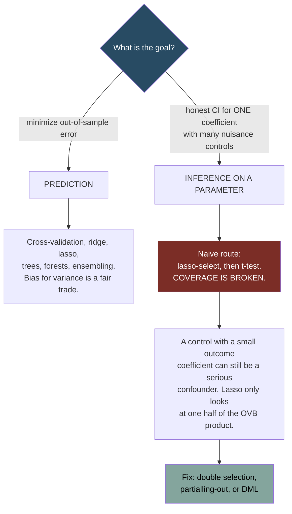
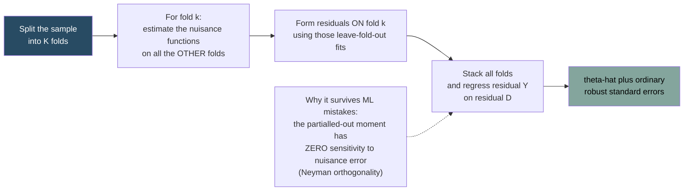

# Model Selection and Machine Learning

Source: Hansen, *Econometrics*, chapters 28-29.

## Two different goals




- **Prediction**: minimize out-of-sample error. Bias is fine if it buys variance. Interpretability optional.
- **Inference on a specific parameter**: get an honest confidence interval for one coefficient of interest, with many nuisance controls.

Machine learning solves the first well. Naively applying it to the second produces confidence intervals with badly wrong coverage. The last third of this note is about the fix.

## Model selection criteria

**AIC** = `-2·log L + 2k`. Estimates out-of-sample prediction error. Asymptotically equivalent to leave-one-out cross-validation. Not consistent for the "true" model — it tends to over-select — but is **efficient** for prediction.

**BIC** = `-2·log L + k·log n`. Heavier penalty. Consistent for the true model if one exists in the candidate set, but can under-select in finite samples.

**Mallows' Cp** — the least-squares analogue of AIC.

Use AIC for forecasting, BIC when you believe in a sparse true model, and — mostly — cross-validation.

## Cross-validation

The most reliable and most general tool.

**K-fold CV**: split the data into `K` folds; for each fold, fit on the other `K-1` and predict the held-out fold; average the prediction errors. `K = 5` or `10` is standard. `K = n` is leave-one-out, which for linear regression has a closed form via leverage — this is exactly the `σ̄²` estimator from [[05 - Least Squares Mechanics]].

Uses: choose a tuning parameter (bandwidth, `λ`, number of series terms), choose between model classes, estimate honest prediction error.

**Do it right**:

- Any data-dependent step — variable screening, standardization, imputation — must happen *inside* each fold. Screening variables on the full data and then cross-validating is a classic leakage error that makes garbage look predictive.
- For time series use **rolling-origin** or blocked CV. Random K-fold on time series lets the model train on the future.
- For clustered data, hold out whole clusters.

## Regularization

**Ridge regression**:
```
β̂ = argmin Σ(Yᵢ - Xᵢ'b)² + λ Σ bⱼ²
```
Closed form `(X'X + λI)⁻¹X'Y`. Shrinks all coefficients toward zero but sets none exactly to zero. Handles collinearity and `p > n`.

The key theoretical result (Hansen's Theorem 29.2): for a range of `λ` strictly between 0 and `2σ²/β'β`, ridge has **strictly lower mean squared error** than OLS. Some shrinkage always helps in MSE terms. This is the bias-variance trade in its purest form.

**Lasso**:
```
β̂ = argmin Σ(Yᵢ - Xᵢ'b)² + λ Σ |bⱼ|
```
The `L1` penalty produces **exact zeros**, so it does variable selection and estimation simultaneously. No closed form; solved by coordinate descent.

Under a **sparsity** assumption (only `s` coefficients are non-zero, `s` small relative to `n`), the lasso is consistent and achieves near-oracle rates, with the theory requiring roughly `s·log(p)/√n → 0`. Note `p` can grow *exponentially* in `n` — that is the remarkable part.

**Elastic net** mixes both penalties:
```
SSE(β,λ,α) = (Y - Xβ)'(Y - Xβ) + λ( α‖β‖₂² + (1-α)‖β‖₁ )
```
with `α = 0` giving lasso and `α = 1` ridge. `(α, λ)` are chosen jointly by K-fold cross-validation. Better than lasso when predictors are correlated in groups. R: `glmnet`. Stata: `elasticnet` or `lassopack`.

**Post-lasso**: run lasso to select variables, then run plain OLS on the selected set. Removes the shrinkage bias in the retained coefficients, and Belloni and Chernozhukov (2013) give conditions under which it has the same convergence rate as lasso. This is standard practice inside the inference procedures below.

But note what post-lasso *is*: a hard-thresholding, post-model-selection estimator. When the regressors are orthogonal it is exactly a selection estimator. So it inherits the PMS pathologies — high variance and non-standard distributions — described in [[21 - Shrinkage and Model Averaging]]. That is precisely why the inference procedures below are needed rather than a naive t-test on the post-lasso output.

**Always standardize** regressors before penalizing — otherwise the penalty depends on units — and never penalize the intercept.

## Why naive post-selection inference is broken

Suppose you lasso-select controls, then run OLS on the selected set, then report the t-statistic on your variable of interest.

This is a **post-model-selection (PMS) estimator**, and its sampling distribution is not the distribution of an OLS estimator. Selection is a discontinuous, data-dependent step, and it induces bias. Hansen shows the coverage of standard confidence intervals for the parameter of interest "can be far from the nominal level", with distortion increasing in the correlation between the treatment `D` and the controls `X`.

The intuition: lasso drops controls whose coefficients are small. But a control with a small coefficient in the outcome equation can still be a serious confounder if it is strongly related to `D` — the omitted variable bias is the *product* of two terms ([[04 - Conditional Expectation and Projection]]), and lasso only looks at one of them.

## Three fixes for honest inference

Model:
```
Y = Dθ + X'β + e,     E[e | D, X] = 0
D = X'γ + V,          E[V | X] = 0
```
`θ` is the parameter of interest; `X` is high-dimensional.

### 1. Double selection (Belloni, Chernozhukov, Hansen 2014)

1. Lasso `D` on `X`. Keep selected set `X₁`.
2. Lasso `Y` on `X`. Keep selected set `X₂`.
3. Let `X̄ = X₁ ∪ X₂`.
4. Regress `Y` on `D` and `X̄` by OLS to get `θ̂_DS`.
5. Use conventional heteroskedasticity-robust standard errors.

The idea: **keep a control if it matters for the outcome OR if it is correlated with the treatment.** The second selection is what fixes the confounding problem the naive approach misses. Under approximate sparsity of both equations, `θ̂_DS` and its t-ratio are asymptotically normal and conventional inference is valid.

Stata: `dsregress` or `pdslasso`. R: `hdm`.

### 2. Post-regularization / partialling-out lasso (Chernozhukov, Hansen, Spindler 2015)

Transform the structural equation to remove `X` entirely:
```
Y - E[Y|X] = (D - E[D|X])θ + e
```
Then:

1. Lasso (or post-lasso) `D` on `X`; get residual `V̂ = D - X'γ̂`.
2. Lasso (or post-lasso) `Y` on `X`; get residual `Û = Y - X'η̂`.
3. Regress `Û` on `V̂`. That coefficient is `θ̂_PR`.
4. Conventional robust standard error.

This is Robinson's partially linear estimator with lasso in place of kernel regression, and it is the Frisch-Waugh-Lovell theorem doing the work again ([[05 - Least Squares Mechanics]]).

**Why it is robust** — this is the elegant part. The moment condition for the naive approach is `m(θ,β) = E[D(Y - Dθ - X'β)]`, whose sensitivity to `β` is `-E[DX']`, non-zero when `D` and `X` are correlated. So errors in estimating `β` propagate into `θ̂`. For the partialled-out moment, the sensitivity is `-E[(D - X'γ)X'] = -E[VX'] = 0`. The moment condition is **locally insensitive to errors in the nuisance parameters** — this is called Neyman orthogonality, and it is why model-selection mistakes wash out.

Efficiency-wise, `θ̂_PR` is more parsimonious than double selection (different components of `X` can matter for `D` and for `Y`); `θ̂_DS` is more robust. Both are valid.

Stata: `poregress`. R: `hdm`.

### 3. Double / debiased machine learning (DML)




Chernozhukov, Chetverikov, Demirer, Duflo, Hansen, Newey, Robins (2018). Adds **cross-fitting** to the partialling-out estimator:

1. Randomly partition the sample into `K` folds.
2. For each fold `k`: estimate `γ` and `η` using **all observations except fold `k`**.
3. Form residuals for fold `k` using those leave-fold-out estimates: `V̂ₖ = Dₖ - Xₖγ̂₋ₖ` and `Ûₖ = Yₖ - Xₖη̂₋ₖ`.
4. Stack all folds and regress `Û` on `V̂`.
5. Conventional robust standard error.

`K = 10` is recommended; computational cost is roughly proportional to `K`.

**Why cross-fitting helps**: without it, the nuisance estimate and the residual in the same observation are dependent, and the resulting error term is `Op(‖γ‖₀ log p/√n)`. With sample splitting they are independent, so the term is mean zero conditionally and its order drops to `Op(√(‖γ‖₀ log p / n))` — a smaller order. In practice this reduces post-selection bias.

The nuisance functions `E[Y|X]` and `E[D|X]` need not be lasso — random forests, boosting, or neural networks work, as long as they converge fast enough (roughly `n^{-1/4}`). This is why DML is the standard bridge between machine learning and causal inference.

**Disadvantages** Hansen flags: the estimate depends on the random split, so two researchers with the same data get different numbers (mitigated by larger `K` or averaging over splits); and nuisance functions are estimated on smaller samples. DML is best suited to large `n`.

Stata: `xporegress`. R: `DoubleML`.

## Lasso IV

For high-dimensional instruments, lasso the first stage to select instruments, then 2SLS. The split-sample and cross-fit versions ("Lasso SSIV") have weaker rate requirements — `‖Γ‖₀ log p / n → 0` rather than `‖Γ‖₀ log p / √n → 0` — because sample splitting breaks the dependence between instrument selection and the second stage. Lasso SSIV is the preferred variant. Note this does **not** dissolve the weak-instrument problem: selecting instruments from a large pool by fit is exactly how you manufacture spuriously strong first stages. See [[11 - Instrumental Variables]].

Stata: `ivlasso`.

## Regression trees

Breiman, Friedman, Olshen and Stone (1984), known as **CART** (Classification And Regression Trees). A regression tree is nonparametric regression by step function: with enough split points, a step function approximates any function. Useful when regressors mix continuous and discrete variables, where kernel and series methods are awkward.

Think of a tree as a zeroth-order spline with free knots, or as threshold regression with intercepts only and many thresholds.

Vocabulary: a subsample is a **branch**; terminal branches are **nodes** or **leaves**; adding branches is **growing**; removing them is **pruning**.

**The split.** The engine is the regression sample split, a simplified threshold regression estimated by nonlinear least squares over the index `d` and threshold `γ` by grid search:
```
Y = μ₁·1{X_d ≤ γ} + μ₂·1{X_d > γ} + e
```

**Growing:**

1. Pick a minimum node size `N_min` (default 5).
2. Repeatedly: apply the split algorithm to each branch (each side keeping at least `N_min`); on each sub-branch the fitted value is the sample mean `μ̂_b` and the residuals are `Yᵢ - μ̂_b`; select the branch whose split most reduces the sum of squared errors; split it and no other; repeat until no branch can be split further.

**Pruning** — backward stepwise on the leaves, using a Mallows-type criterion
```
C = Σᵢ êᵢ² + αN        N = number of leaves
```
Remove the leaf whose removal most decreases `C`; stop when no removal helps. `α` is chosen by K-fold cross-validation. Hansen notes the Mallows-type criterion is used for simplicity and "does not have a theoretical foundation for regression tree penalty selection".

**Weaknesses.** No coefficients, so results are hard to interpret. The fit is a step function, a crude approximation to a smooth `m(x)` — getting a good approximation needs many leaves, which means high variance. And the sampling distribution is hard to derive because the split locations and the within-leaf means are strongly correlated — the same problem as post-model-selection.

**Honest trees** (Wager and Athey 2018) break that dependence: split the sample into halves `A` and `B`, use `A` to place the splits and `B` to estimate within-leaf means. This halves the effective sample but removes the distortion.

R: `rpart`.

## Bagging

**B**ootstrap **agg**regat**ing** (Breiman 1996). Draw `B` bootstrap samples, estimate the model on each, and average:
```
m̂_bag(x) = (1/B) Σ_b m̂*_b(x)
```

Why it works: bagging turns a **hard threshold** into a **soft** one. For the selection estimator `θ̂_pms = θ̂·1{θ̂² ≥ c}`, the bagged version is `E*[h(θ̂*)] = g(θ̂)` where `g` is a smooth, everywhere-differentiable version of the discontinuous `h`. Smooth transformations have lower variance than hard thresholds (Bühlmann and Yu 2002), and Hansen's numerical comparison shows the bagged estimator's MSE is substantially below the selection estimator's over most of the parameter space — with the biggest gains exactly where the selection estimator is worst.

So bagging helps for **low-bias, high-variance** estimators — regression trees, model selection, post-lasso. It is *not* expected to help for high-bias estimators, where averaging may amplify the bias.

**Out-of-bag error.** A bootstrap sample contains about 63% of the original observations, so about 37% are left out. For observation `i`, average only over the ~0.37B bootstrap trees that exclude it, giving `m̂₋ᵢ(Xᵢ)`; then `ẽᵢ = Yᵢ - m̂₋ᵢ(Xᵢ)` and the **out-of-bag CV criterion** is `Σẽᵢ²`. A free cross-validation estimate of out-of-sample MSFE — no extra fitting needed.

**Variance.** The **infinitesimal jackknife** (Wager, Hastie and Efron 2014):
```
V̂ₙ(x) = Σᵢ ( (1/B) Σ_b (N_ib - Nᵢ)(m̂*_b(x) - m̂_bag(x)) )²
```
where `N_ib` counts appearances of observation `i` in bootstrap sample `b`.

## Random forests

Breiman (2001). Bagged trees are highly correlated with one another — they tend to split on the same variables — so averaging them does not reduce variance as much as it should. Random forests **decorrelate** the trees by restricting each split to a random subset of regressors.

Algorithm (defaults from Hastie, Tibshirani and Friedman):

1. Pick minimum leaf size `N_min` (default 5), minimal split fraction `α ∈ [0,1)`, and sampling number `m < p` (default `p/3`).
2. For `b = 1,...,B`: draw a bootstrap sample; grow a tree where at each split you **select `m` variables at random from the `p` regressors** and split on the best of those (each side keeping at least `N_min` observations and a fraction `α` of the branch); stop when each leaf has between `N_min` and `2N_min - 1` observations; the fitted value on each leaf is the sample mean.
3. `m̂_rf(x) = (1/B) Σ_b m̂_b(x)`.

**Inference.** Wager and Athey (2018) establish pointwise consistency and asymptotic normality:
```
(m̂_rf(x) - m(x)) / √V̂ₙ(x)  →d  N(0,1)
```
under assumptions that the conditional mean and variance are Lipschitz, `X ~ U[0,1]^p` with `p` fixed, the forest is built by **subsampling** (not the full bootstrap) with **honest trees**, and `0 < α ≤ 0.2`. Note the limit has **no bias term** — the estimator is undersmoothed by construction. The variance can be estimated by the infinitesimal jackknife above.

The theory is remarkably weak on rates: it does not tell you how fast the estimator converges. The mechanism is that the splitting rules divide the regressor space into `N ~ n^γ` leaves, so the estimator is asymptotically unbiased at a power rate, and `α > 0` ensures observations per leaf grow with `n`.

R: `randomForest`.

## Ensembling

Model averaging across machine learning algorithms — CV selection, James-Stein, JMA, SBIC, PCA, kernel regression, series regression, ridge, lasso, regression trees, bagged trees, random forests. Rather than picking the method that happens to work best on your data, average them.

The popular method, **stacking**, is exactly Jackknife Model Averaging: choose non-negative weights summing to one by minimizing a cross-validation criterion. See [[21 - Shrinkage and Model Averaging]].

Hansen's caveat is worth repeating: "the theoretical literature concerning ensembling is thin. Much of the advice concerning specific methods is based on empirical performance."

## Where prediction methods legitimately belong in econometrics

- **Estimating nuisance functions** for the procedures above.
- **Propensity score estimation** in high dimensions.
- **Heterogeneous treatment effects**: causal forests, generic ML inference on CATEs.
- **Constructing variables**: extracting features from text, images, or satellite data to use downstream.
- **Genuine forecasting problems** where nobody is claiming causality.

Where they do **not** belong: as a substitute for an identification argument. A random forest that predicts `Y` from `D` extremely well tells you nothing about what would happen if you changed `D`. See [[10 - Causality and Identification]].

## Practical checklist

1. Say which goal you have: prediction or inference on a parameter.
2. For prediction, evaluate honestly out of sample with the correct CV scheme for your data structure.
3. For inference with many controls, use double selection, partialling-out, or DML — never naive post-selection.
4. Standardize before regularizing; do not penalize the intercept; report `λ` and how you chose it.
5. Record random seeds — lasso paths, CV folds, and DML splits are all stochastic.
6. Report sparsity: how many variables were selected, and which ones.
7. Compare against a simple benchmark (OLS with a handful of sensible controls). If ML changes the answer a lot, understand why before believing it.

Related:

- [[05 - Least Squares Mechanics]]
- [[10 - Causality and Identification]]
- [[11 - Instrumental Variables]]
- [[16 - Nonparametrics, Quantiles, and RDD]]
- [[19 - Applied Workflow and Common Mistakes]]
- [[20 - Multivariate Regression and Factor Models]]
- [[21 - Shrinkage and Model Averaging]]
