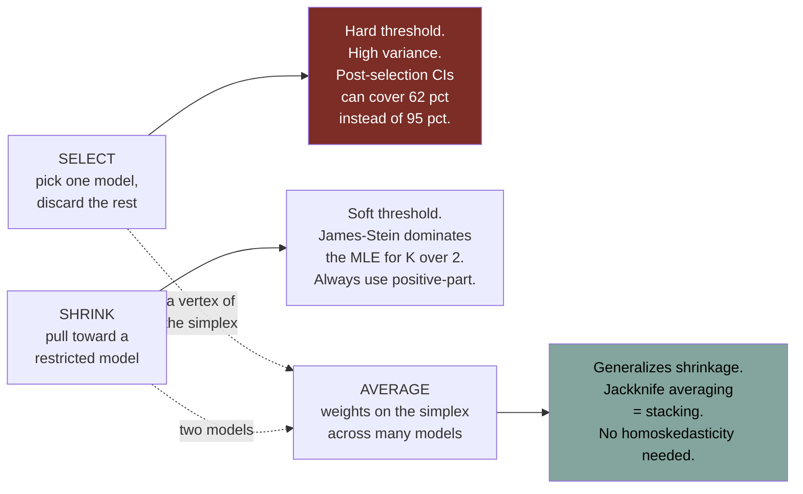

# Shrinkage and Model Averaging

Source: Hansen, *Econometrics*, chapter 28 (sections 28.15-28.31); *Probability and Statistics for Economists*, chapter 15.

Model selection picks one model and throws the rest away. This note covers the two things you can do instead: **shrink** toward a simpler model, or **average** across models. Both usually beat selection.

## The spectrum: select, shrink, or average



Model selection is the special case of averaging where all the weight sits on one vertex. Shrinkage is the two-model case. Averaging is the general object — and it usually wins.

## Why not just select?

### Best subset and stepwise regression

With `K` candidate regressors there are `M = 2^K` subsets. `K = 10` gives 1,024; `K = 20` gives over a million; `K = 40` gives more than a trillion. Exhaustive search is infeasible beyond small `K`.

**Backward stepwise**: start with all regressors; at each step drop the one whose removal least worsens the criterion `C(m)`; record the criterion at each size; pick the best. Requires `K < n`. Under AIC, the drop step reduces to removing the regressor with the smallest absolute (homoskedastic) t-ratio.

**Forward stepwise**: start empty; at each step add the regressor whose inclusion most improves `C(m)`. Under AIC, this is adding the regressor with the largest absolute correlation with the current residual.

Neither actually minimizes the criterion over all subsets — they are computational approximations. Stata: `stepwise, pr(.32)` (backward, AIC) or `stepwise, pe(.32)` (forward, AIC). R: `lars`. Hansen notes that the old significance-testing versions of stepwise are "generally not advised".

### The MSE of a selection estimator

Take `θ̂ ~ N(θ, I_K)` and the post-model-selection (PMS) estimator

```
θ̂_pms = θ̂  if θ̂'θ̂ > c,   0 otherwise
```

AIC sets `c = 2K`, BIC sets `c = K log(n)`, a 5% test sets `c` to the `χ²_K` 95% quantile.

**Theorem 28.10**: `mse[θ̂_pms] = K + (2λ - K)F_{K+2}(c, λ) - λF_{K+4}(c, λ)` where `λ = θ'θ` and `F_r(·, λ)` is the non-central chi-square CDF.

Read the limits: at `λ = 0`, MSE is `K(1 - F_{K+2}(c,0))` — selection helps a lot. As `λ → ∞`, MSE → `K` (the unselected estimator). As `c → ∞`, MSE → `λ`, which means **the MSE of BIC selection diverges as `n → ∞`** for a fixed non-zero `θ`.

Numerically: PMS has lower MSE than the unselected estimator roughly for `λ < K`, and **higher** for `λ > K`. AIC's distortion peaks around 1.5× for `K = 1`; BIC's peak is much larger and grows with `n`.

Hansen's recommendation from this: **do not use BIC for model selection, and use AIC with care.**

### Inference after selection is broken

Consider `Y = X₁β₁ + X₂β₂ + e`, select on `X₂` by a 5% t-test, then build a standard 95% interval for `β₁` in the selected model. Simulation with `(X₁, X₂)` jointly normal with correlation `ρ`, `n = 30`, one million replications:

| `ρ` | Minimum coverage of a nominal 95% CI |
| --- | --- |
| 0 | 95% |
| 0.3 | ~93% |
| 0.5 | **88%** |
| 0.7 | **75%** |
| 0.8 | **62%** |

Coverage is exactly right at `ρ = 0` (the selection t-statistic is independent of `β̂₁`) and recovers as `β₂ → 0` or `β₂ → ∞`. The damage is at *intermediate* `β₂`, where selection genuinely swings between models and the selection decision is correlated with `β̂₁`.

Hansen: "Conventional inference procedures do not have conventional distributions and the distortions are potentially unbounded." This is the same problem that motivates double selection and DML in [[18 - Model Selection and Machine Learning]].

## Shrinkage

### The basic trade-off

Take `θ̃ = (1 - w)θ̂` for shrinkage weight `w ∈ [0,1]`. With `θ̂ ~ (θ, V)`:

```
bias[θ̃] = -wθ
var[θ̃]  = (1-w)²V
wmse[θ̃] = K(1-w)² + w²λ,     λ = θ'V⁻¹θ,  W = V⁻¹
```

**Theorem 28.11**:
1. `wmse[θ̃] < wmse[θ̂]` for all `0 < w < 2K/(K + λ)`.
2. Minimized at `w₀ = K/(K + λ)`.
3. Minimized value is `Kλ/(K + λ)`.

So some shrinkage always helps. When coefficients are large relative to their estimation variance (`λ` large), optimal shrinkage is small; when small, shrink hard. At `λ = K`, the optimal WMSE is half that of the original estimator.

`λ` is unknown; an unbiased estimator is `λ̂ = θ̂'V⁻¹θ̂ - K`, giving the feasible weight `ŵ = K/(θ̂'V⁻¹θ̂)` and the **Stein-Rule estimator**

```
θ̃ = (1 - c/(θ̂'V⁻¹θ̂)) θ̂
```

Note what `θ̂'V⁻¹θ̂` is: **the Wald statistic for `H₀: θ = 0`**. So the Stein rule is a *smoothed* selection estimator — when the evidence against zero is strong the estimator stays near `θ̂`; when weak it shrinks toward zero.

### James-Stein

**Theorem 28.12** (James and Stein 1961). With `θ̂ ~ N(θ, V)` and `K > 2`:

1. `wmse[θ̃] < wmse[θ̂]` for all `0 < c < 2(K-2)` — for *every* value of `θ`.
2. WMSE is minimized at `c = K - 2`.

```
θ̃_JS = (1 - (K-2)/(θ̂'V̂⁻¹θ̂)) θ̂
```

This result "stunned the world of statistics". The MLE is unbiased, minimum-variance-unbiased, and Cramér-Rao efficient — and it is **dominated** in MSE by a biased estimator, hence inadmissible. The condition `K > 2` is essential: shrinkage achieves uniform improvement only in dimension three or higher.

There is no contradiction with Cramér-Rao, which restricts attention to *unbiased* estimators. And no contradiction with the PMS results above: selection is a **hard threshold** (discontinuous, high variance), James-Stein is a **soft threshold** (continuous, low variance). That distinction is the whole reason shrinkage works where selection does not.

### Positive-part trimming

Plain James-Stein can over-shrink: if `θ̂'V⁻¹θ̂ < K - 2`, the weight goes negative and `θ̃` flips sign relative to `θ̂`. Fix by bounding the weight:

```
θ̃⁺ = (1 - (K-2)/(θ̂'V̂⁻¹θ̂))₊ θ̂
```

**Theorem 28.13**: `wmse[θ̃⁺] < wmse[θ̃]` — uniformly better. The positive-part estimator performs selection *and* shrinkage: it selects zero when the Wald statistic is small, shrinks for moderate values, and is near `θ̂` for large values. Always use it.

### Shrinking toward restrictions (the useful version)

Nobody wants to shrink a whole coefficient vector to zero. What you actually want is to shrink toward a *restricted model*. Given restrictions `R'θ = r` (`q > 2` of them), the restricted estimator is

```
θ̂_R = θ̂ - V̂R(R'V̂R)⁻¹(R'θ̂ - r)
```

and the positive-part Stein estimator toward it is

```
θ̃⁺ = θ̂ - ((q-2)/J)₁ (θ̂ - θ̂_R),      J = (θ̂ - θ̂_R)'V̂⁻¹(θ̂ - θ̂_R)
```

with `(a)₁ = min[a, 1]`. **Theorem 28.14**: uniformly smaller WMSE when `q > 2`.

`J` is the minimum-distance statistic for testing the restrictions. So the shrinkage weight is a smoothed version of the test: large `J` (restrictions rejected) → stay at `θ̂`; small `J` → move to `θ̂_R`. You can substitute any asymptotically equivalent statistic — Wald, LR, score, or `q ×` the F statistic. In linear regression there is a convenient form:

```
J = n(σ̂²_R - σ̂²)/s²
```

computable straight from two regressions' error variances.

Typical applications: shrink a long regression toward a short one; shrink toward an intercept-only model; shrink heterogeneous estimates toward a common mean; shrink a nonparametric series model toward a parametric one.

**Practical note**: when `K` is large or the model has sparse dummies, robust and cluster-robust covariance matrices are ill-behaved, and it is better to use the classical covariance matrix inside the shrinkage weight even if you report robust standard errors elsewhere.

### Group James-Stein

Partition `θ = (θ₁,...,θ_G)` into blocks of dimension `K_g ≥ 3` and shrink each separately:

```
θ̃_g = θ̂_g (1 - (K_g - 2)/(θ̂_g'V̂_g⁻¹θ̂_g))₊
```

**Theorem 28.15**: uniformly smaller WMSE when every `K_g > 2`.

Grouping advice: group coefficients that are expected to need *similar amounts of shrinkage* (e.g. low-order and high-order polynomial terms separately), and group so that your loss function is separable across groups (e.g. education coefficients and experience coefficients separately if you report them for different purposes).

### Hansen's three empirical illustrations

All three found shrinkage weights near 0.5 at moderate-to-large sample sizes, which makes the point that Stein shrinkage is not a small-sample curiosity:

1. **CPS Asian women, `n = 1149`**: shrink a 6th-order experience polynomial toward a quadratic. Weight 0.46. The result keeps the quartic's features but smooths out an implausible dip at 25 years.
2. **Investment panel, `N = 786` firms, `n = 5692`**: shrink firm fixed effects toward 19 industry dummies. Weight 0.35 (1/3 industry, 2/3 firm). The shrunk density of firm effects is sharper and less dispersed — the raw FE estimates were attributing noise to firm heterogeneity.
3. **CPS Black men, `n = 2413`**: shrink four region-specific education profiles toward a common-slope model (18 restrictions). Weight 0.49. The shrunk profiles are visibly less noisy and reveal a stable regional ranking that the raw estimates obscured.

## Model averaging

### The setup

`M` models, each with an estimator `θ̂_m`. Weights `w = (w₁,...,w_M)` on the **probability simplex** (`w_m ≥ 0`, `Σw_m = 1`). The **averaging estimator** is

```
θ̂(w) = Σ_m w_m θ̂_m
```

Model *selection* is the special case where `w` is a unit vector — a vertex of the simplex. Averaging lets you sit on an edge or in the interior.

The MSE result from Theorem 28.11 extends: **the MSE of the optimal averaging estimator is less than that of the full model's estimator in any given sample.** The question is how to choose the weights.

### Equal weighting

`w_m = 1/M`. Simple, no estimation noise in the weights, works even across models from different probability families. Disadvantages: sensitive to which models you put in the set, no guarantee of beating the unrestricted estimator, and inefficient use of the sample. Hansen's verdict: "not a proper statistical method as it is an incomplete methodology" — but genuinely useful for summarizing a handful of reasonable estimates for a non-technical audience, where the average represents a "consensus".

### Smoothed BIC and AIC

From Schwarz's theorem, the marginal likelihood satisfies `p(Y) ≈ exp(-BIC/2)`, so weighting by approximate posterior model probability gives the **BIC weights**

```
w_m = exp(-BIC_m/2) / Σⱼ exp(-BICⱼ/2)
```

and the **SBIC** estimator `Σ w_m θ̂_m`. Burnham and Anderson's **AIC weights** apply the same transform to AIC.

**Compute with differences, not levels.** Let `BIC* = min_m BIC_m` and `ΔBIC_m = BIC_m - BIC*`. Then

```
w_m = exp(-ΔBIC_m/2) / Σⱼ exp(-ΔBICⱼ/2)
```

which is algebraically identical and avoids exponential overflow. Since `ΔBIC ≥ 10` implies `w_m ≤ 0.01`, smoothed BIC concentrates weight on very few models. AIC weights are more spread out because AIC penalizes less.

### Mallows model averaging (MMA)

For linear regression with homoskedastic errors, apply the Mallows criterion directly to the averaging estimator. With `P(w) = Σ w_m P_m` and residual `ê(w) = (I - P(w))Y`:

```
C(w) = ê(w)'ê(w) + 2σ̄² Σ_m w_m K_m
     = w'Ê'Êw + 2σ̄² K'w
ŵ_mma = argmin_{w ∈ S} C(w)
```

The penalty is the **average** number of coefficients across models, weighted by `w`. Since `C(w)` is quadratic in `w` and the simplex is defined by linear constraints, this is a **quadratic programming** problem — `solve.QP` in R, `quadprog` in MATLAB. Solutions tend to sit on edges and vertices, so most models receive exactly zero weight.

For `M = 2` nested models the minimizer is

```
ŵ = ( σ̄²(K₂ - K₁) / (ê₁'ê₁ - ê₂'ê₂) )₁
```

which is a Stein-Rule weight with a slightly different shrinkage constant. **So MMA for `M > 2` is a generalization of James-Stein to multiple models.** B. E. Hansen (2014) shows MMA has lower WMSE than unrestricted least squares when the models are nested, errors homoskedastic, and models separated by four or more coefficients; Hansen (2007) shows it asymptotically achieves the same MSE as the infeasible optimal weighted average.

### Jackknife (CV) model averaging — a.k.a. stacking

Mallows requires homoskedasticity. Cross-validation does not. Let `ẽ_mi` be the leave-one-out prediction error of model `m` for observation `i`, and `Ẽ` the `n × M` matrix of them. The averaged LOO error is `ẽ(w) = Ẽw`, so

```
CV(w) = w'Ẽ'Ẽ w
ŵ_jma = argmin_{w ∈ S} CV(w)
```

Again quadratic programming, again sparse solutions, and it simultaneously performs selection and shrinkage. Hansen and Racine (2012) show JMA is asymptotically equivalent to the infeasible optimal weighted average under mild conditions **including conditional heteroskedasticity**.

**In machine learning this is called stacking.** It is the same estimator.

### Granger-Ramanathan averaging

Split the sample. Estimate the `M` models on the estimation half; form fitted values `Ỹ_mi` on the evaluation half; regress `Yᵢ` on `(Ỹ_1i,...,Ỹ_Mi)` with no intercept. The coefficients are the weights.

Impose `ŵ_m ≥ 0` and `Σŵ_m = 1` — the unconstrained version produces "extremely erratic empirical weights, especially when `M` is large". Best suited to very large samples where losing half the data to the split does not hurt.

### Empirical comparison

The nine wage models from Hansen's CPS example (return to experience among Asian women, `n = 1149`):

| Method | M1 | M2 | M3 | M4 | M5 | M6 | M7 | M8 | M9 | Return |
| --- | --- | --- | --- | --- | --- | --- | --- | --- | --- | --- |
| SBIC | .02 | **.96** | .00 | .00 | .04 | .00 | .00 | .00 | .00 | 22% |
| SAIC | .00 | .02 | .10 | .00 | .15 | **.44** | .00 | .06 | .22 | 38% |
| MMA | .09 | .02 | .02 | .00 | .30 | .00 | .00 | .00 | **.57** | 39% |
| JMA | .17 | .00 | .08 | .00 | **.57** | .01 | .00 | .00 | .17 | 34% |

Note: SBIC dumps 96% of the weight on one model and gives a much smaller estimate than everything else — the same over-parsimony that shows up in the MSE analysis. The three non-BIC methods agree closely (34-39%) despite putting weight on quite different models, and MMA/JMA happily split weight across models as different as 1 and 9.

For reference, the individual model estimates ranged from 13% to 47%, so the choice of model matters more than the choice of averaging method.

## Ensembling

Model averaging across *machine learning algorithms* — CV selection, James-Stein, JMA, SBIC, PCA, kernel regression, series regression, ridge, lasso, regression tree, bagged tree, random forest. The most popular method, **stacking**, is exactly Jackknife Model Averaging: minimize a cross-validation criterion over weights on the simplex.

Hansen's caveat: "the theoretical literature concerning ensembling is thin. Much of the advice concerning specific methods is based on empirical performance."

## Practical guidance

1. If you must select, use AIC or cross-validation. Avoid BIC for selection unless you genuinely believe a sparse true model exists.
2. Never report conventional confidence intervals from a model you selected on the same data.
3. Prefer shrinkage or averaging to selection. Both dominate it in MSE under stated conditions.
4. Shrink toward a *restricted model* you can defend, not toward zero.
5. Always use the positive-part version.
6. JMA/stacking is the safest default weighting method: it needs no homoskedasticity assumption and is computationally trivial.
7. Report the weights. They tell the reader which specifications the data actually support.

Related:

- [[08 - Hypothesis Testing and Confidence Intervals]]
- [[09 - Bootstrap and Resampling]]
- [[18 - Model Selection and Machine Learning]]
- [[20 - Multivariate Regression and Factor Models]]
- [[22 - Bayesian Methods]]
