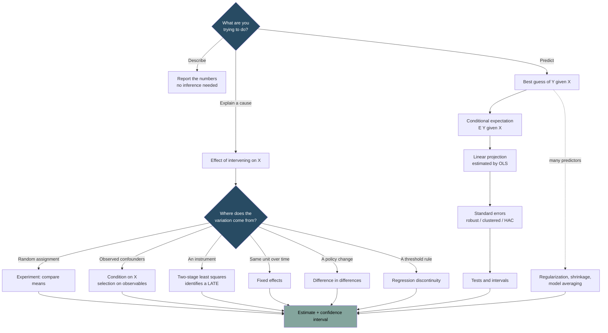

# Econometrics

Learning econometrics from Bruce Hansen's two 2022 Princeton textbooks: *Probability and Statistics for Economists* and *Econometrics*.

Written for a beginner: intuition first, formula second, worked numbers third.

## The whole topic in one picture

The whole subject is one loop repeated: **define a population quantity, build a sample analog, work out how far off it is likely to be, and ask whether it answers the question you actually care about.** The fourth step is where causal claims live or die.

## Entry points

- [[00 - Econometrics Hub]] — reading paths, note index, notation
- [[98 - Formula Cheatsheet]] — every formula, grouped by topic
- [[99 - Econometrics Glossary]] — terms in one place
- [[Econometrics Map]] — spatial canvas of the whole topic

## Foundations

- [[01 - What Econometrics Is]]
- [[02 - Probability Foundations]]
- [[03 - Statistical Inference Foundations]]
- [[04 - Conditional Expectation and Projection]]
- [[05 - Least Squares Mechanics]]
- [[06 - Standard Errors and Clustering]]
- [[07 - Asymptotic Theory]]
- [[08 - Hypothesis Testing and Confidence Intervals]]
- [[09 - Bootstrap and Resampling]]

## Causal inference

- [[10 - Causality and Identification]]
- [[11 - Instrumental Variables]]
- [[12 - GMM and Minimum Distance]]
- [[13 - Panel Data]]
- [[14 - Difference in Differences]]
- [[16 - Nonparametrics, Quantiles, and RDD]]
- [[17 - Limited Dependent Variables]]

## Prediction and modern methods

- [[15 - Time Series]]
- [[18 - Model Selection and Machine Learning]]
- [[20 - Multivariate Regression and Factor Models]]
- [[21 - Shrinkage and Model Averaging]]
- [[22 - Bayesian Methods]]
- [[23 - Nonparametric Density Estimation]]

## Practice

- [[19 - Applied Workflow and Common Mistakes]]

## Suggested learning path

1. Read [[01 - What Econometrics Is]] to fix the vocabulary — population vs sample, estimand vs estimator.
2. Build the statistical base: [[02 - Probability Foundations]] then [[03 - Statistical Inference Foundations]].
3. Understand what a regression actually estimates: [[04 - Conditional Expectation and Projection]]. This is the pivotal note.
4. Learn the mechanics and the inference: [[05 - Least Squares Mechanics]], [[06 - Standard Errors and Clustering]], [[08 - Hypothesis Testing and Confidence Intervals]].
5. Cross into causality with [[10 - Causality and Identification]], then pick the design that matches your data: [[11 - Instrumental Variables]], [[13 - Panel Data]], [[14 - Difference in Differences]], or the RDD section of [[16 - Nonparametrics, Quantiles, and RDD]].
6. Keep [[19 - Applied Workflow and Common Mistakes]] open while doing actual work.

Related:

- [[topics/README|Topics]]
- [[topics/hft/30 - Data and Research/47 - Quant Topics for HFT Research|Quant Topics for HFT Research]]
